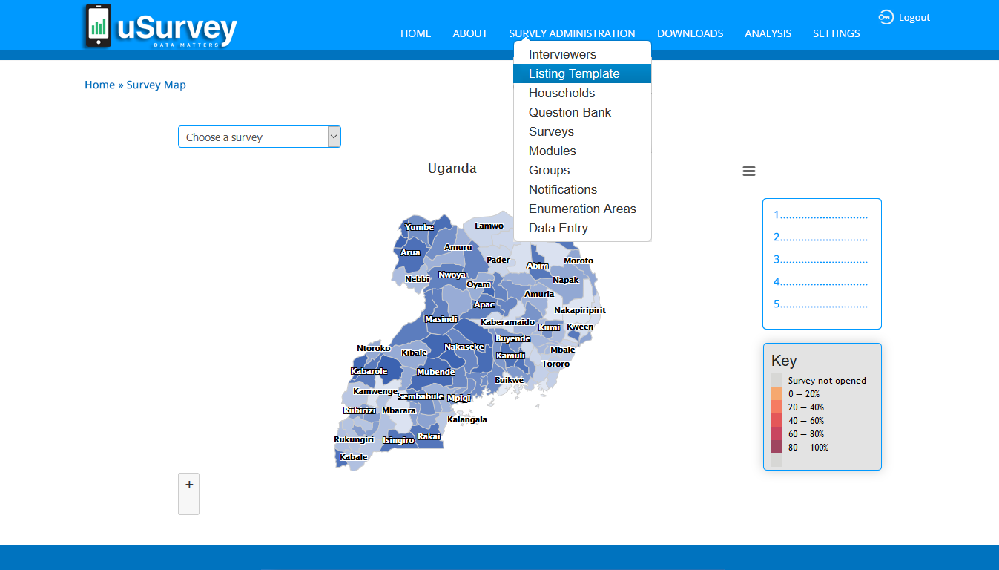
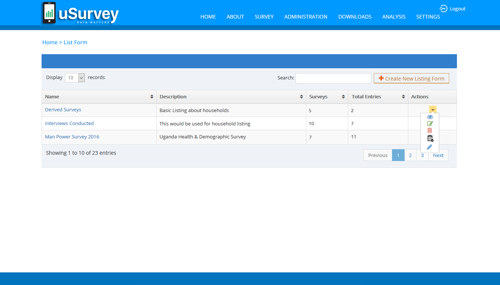
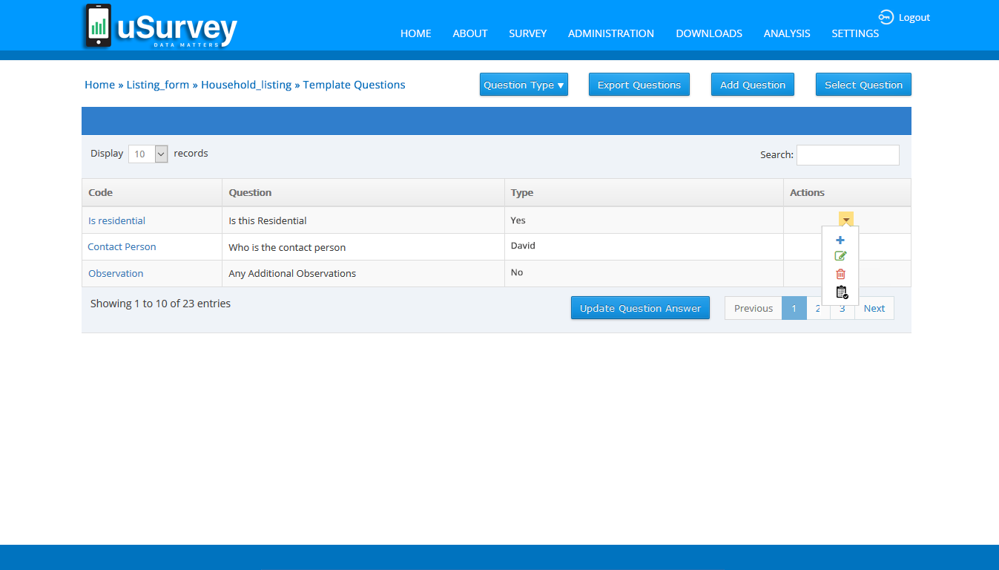
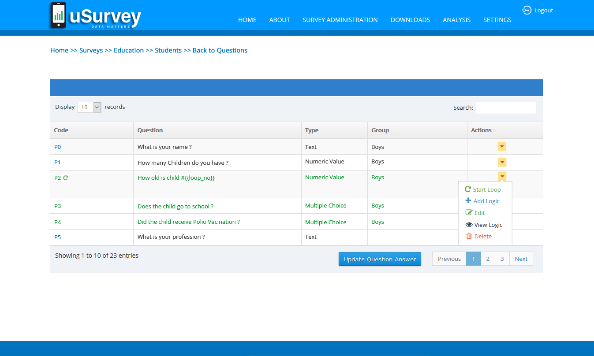
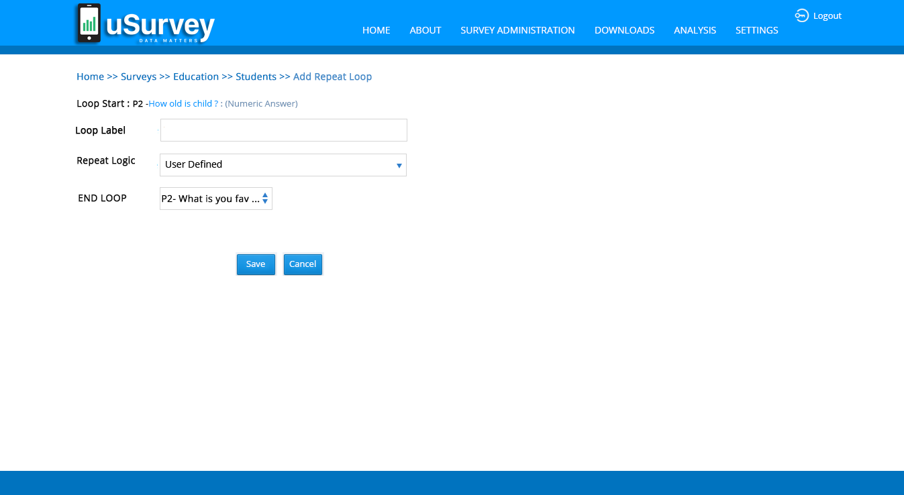
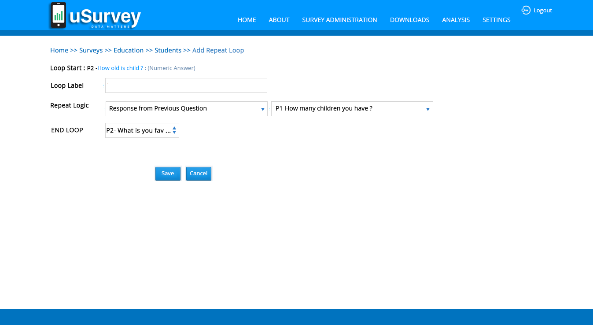

###Listing: 
The Listing be carried out by field staff other than interviewers, as a separate field operation conducted before the survey starts.
Survey has to be simplified to the Interviewer in identifying the household respondents, one who is eligible for this particular survey, based up on these Listing Questions.

Survey Listing is available from main menu under Survey <b>Administration</b> >> <b>Listing Form</b>

Listing is set of Questions can be customized/configurable for any survey by reusing same Listing template, implementing Looping concept and apply logic to the Questions.

###Creating New Listing:
To create a new Listing, click on the ‘Create New Listing Form’ button, this will open a pop form where one can create a new Listing, by providing Name of the Listing, Description and select Access channels (OBK, USSD)

The ‘Listing Form’ page by default shows list of all existing Listings and each of these Listing items has Actions to ‘Edit’, ‘Delete’ and ‘View/Edit Questions’.

<b>Edit – Listing</b>: On click, Action Item ‘Edit’, User can Edit only the name of the Listing, Description and selection of Access channels (OBK, USSD)

<b>Delete – Listing</b>: On click, Action Item ‘Delete, the entire Listing is removed.

<b>View/Edit Questions – Listing</b>: On click, Action Item ‘View/Edit Questions’, User navigates to ‘Listing Form Questions Template’ page to View or Edit respective Questions in Listing

###Listing Form Questions Template:

The ‘Listing Form Questions Template’ page by default shows list of all Questions in Listing, if/that exists and each of these Question items has Actions to ‘Edit’, ‘Insert Question’, ‘Manage Loop’, ‘Add Logic’, ‘Remove’ and ‘View Options’- for Multiple Choice Type Question.

###Adding Questions to the Listing Form: 
In the ‘Listing Form’ page click on the respective Listing Name / on Action item ‘View/Edit Questions’ to navigate to ‘Listing Form Questions Template’ form where one can Add New Questions to the Listing by clicking on ‘Add Question’ Button, this will open a pop form where one can write a Question, by providing ‘Variable Name’, ‘Text’ (Question), ‘Answer Type’ and select/ check ‘Mandatory’ to mark the Question as to answer compulsory.

<b>Export Questions</b>: On click, ‘Export Questions’ button user can download the Listing Questions in “.csv” file format.

<b>Select Question</b>: On click, ‘Select Question’ button, User navigates to ‘Select Question from Question
Library’ where one can select the Questions from Library into Listing, by sorting out using ‘Search with text’ and ‘Question Type’ methods. 

To select the Question from Library List to Listing, just Click on “Code” or “Text” to move between tables (Library << / >> Listing List)

<b>Edit – Listing Question</b>: On click, Action Item ‘Edit’, User can Edit respective Question, ‘Variable Name’, ‘Text’ (Question), ‘Answer Type’ and select/ check ‘Mandatory’ to mark the Question as to answer compulsory.

<b>Insert Question</b>: On click, Action Item, ‘Insert Question’ by which User can insert a New Question below the respective Question and rest of the thing is similar to ‘Add New Question’.

<b>Manage Loop</b>: On click, Action Item, ‘Manage Loop’ this in terms, applying the Looping concepts in Listing Questions, here one has to define the Looping concept for respective question by providing ‘Loop label’, ‘Repeat Logic’, ‘Loop Ends At, and ‘Loop Prompt’. As follows:

<b>Loop label</b>: naming the Loop

<b>Repeat Logic: ‘User Defined’</b> – is chosen, need to define ‘Loop Ends At’, that is this set of Question come into loop, starting from this particular question and has to end loop with any of the consecutive question in the Listing to be chosen here. And ‘Loop Prompt’ – this is a message prompt shown in ODK at the time of capturing survey details about the “user defined” question.

<b>Repeat Logic: ‘Fixed number of repeats’</b>– is chosen, need to define ‘Repeat count’ – any specific no of times loop to be repeated. And ‘Loop Ends At’ – specify that at which, Question this loop should close. 

<b>Repeat Logic: ‘Response from previous question’</b>– is chosen, need to define ‘Previous numeric values’ – this logic based up on count/ number provided in this previous question and ‘Loop Ends At’ - specify that at which, Question this loop should close.

<b>Loop Ends At</b>:  specify that at which, Question this loop should close

<b>Loop Prompt</b>: this is a message prompt shown in ODK at the time of capturing survey details about the “user defined” question

<b>Add Logic</b>: On click, Action Item, ‘Add Logic’ defines the probability of logics can apply to Looping concept, here one has to define the Logic for respective question by providing ‘Eligible Criteria’, ‘Attribute’, ‘Then’ As follows:

<b>Eligible Criteria</b>: based up on this particular Question value matching

<b>Attribute</b>: shows the matching value

<b>Then: ‘Reconfirm’</b> – need the conformation from this particular Answer from Question,
‘End Interview’ – based up on this particular Question end looping of questions, ‘Ask Sub-Question’ – based up the ‘Attribute’ value, a new question is created, ‘Skip To’ - based up the ‘Attribute’ value question(s) can be hidden and jump to any consecutive question in the Listing to be chosen here.

The above applied logic is shown in Table “Existing Logic”
Which shows the applied logic to each question and has the option to ‘Delete’ the Sub-Question /Logic

<b>Edit Sub-Question /Logic</b>: 
In the ‘Listing Form Questions Template’ page, Questions that has Logic are hyperlinked, click on the respective Question that shows options to view logic, Edit, Delete.

<b>Remove</b> – Listing Question: On click, Action Item ‘Remove, respective Listing Question is removed.

<b>View Options</b>: On click, Action Item, show the Options of Multiple Choice Type Question.

<b>Update Question Order</b>:  On click, this button user can update the rearranged order of the Question, 

<b>Change order of the Question</b>: To change the order of the Question, just select the Question to drag and drop at the required order, then click on ‘Update Question Order’ button 
