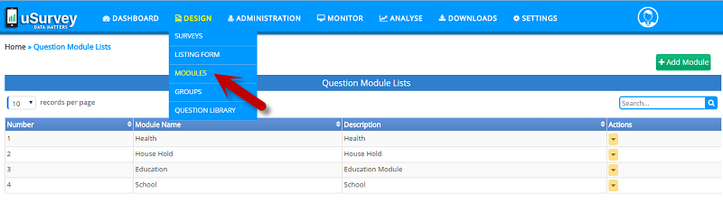
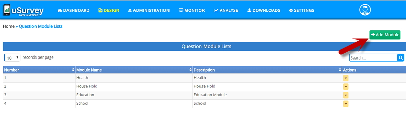
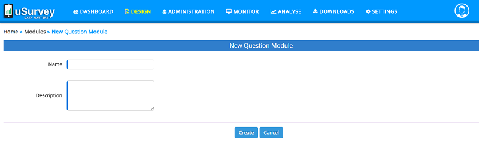
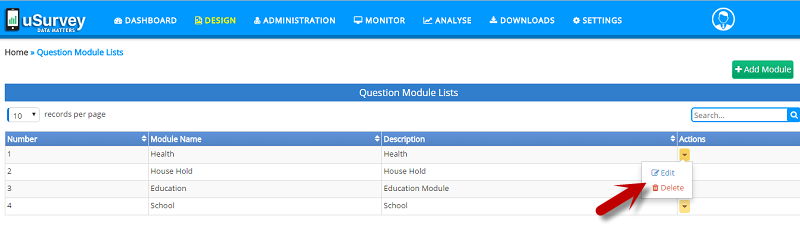

###Modules:
Modules are Survey based classification based up on survey type and need.
Modules are available from main menu under, <b>Design</b> >> <b>Modules</b>

To create a new Module, click on ‘Add Module’ button at top right of the Modules page, that opens a form to create a new Module.

<b>Elements of Module</b>:

<b>Name</b>: Name of a Module, which is a unique identity to a Module and is a mandatory field.   

<b>Description</b>: A short description about Module

A Module is created by providing above field and click on ‘Create’ button to Create a Module. 

On the ‘Modules’ page you can view all the Modules created in the application. each of these Module has Actions to ‘Edit’ and ‘Delete’.

<b>Actions in Modules</b>:

* Edit Module: click on, Action Item ‘Edit’, User can Edit Name and Description of the Module. 
* Delete Module: click on, Action Item ‘Delete, the Module is removed, before deleting you will be prompted with conformation to delete, click ‘Yes’ to Delete permanently.