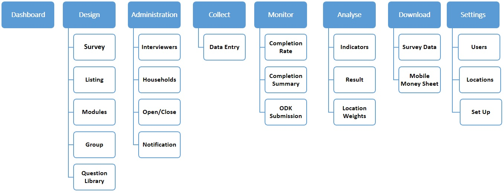

###Process flow:

###Overview:

###Sitemap:
-----------
###uSurvey Home

* **Dashboard**

* **Design** 
  * [Survey](./Survey.md)
  * [Listing](./Listing.md)
  * [Modules](./Modules.md)
  * [Groups](./Groups.md)
  * [Question Library](./Library.md)

* **Administration** 
  * [Interviewers](./Interviewer.md)
  * [Notification](#)
  * [Data Entry](#)

* **Monitor**
  * [Listing Data](#)
  * [Batch Data](#)
  * [Completion Summary](#)
  * [ODK Submission](./ODK_App.md)

* **Analyse** 
  * [Indicators](./Indicators.md)
  * [Location Weights](#)

* **Download**
  * [Survey Data](#)
  * [Mobile Money Sheet](#)

* **Settings**
  * [Users](#)
  * [Locations](#)
  * [Setup](#)

* **User Profile**
  * [User](#)
  * [Active Power Mode](#)
  * [Change Password](#)
  * [Logout](#)