###Login
------
Welcome to uSurvey portal, enrolled users can access the portal by their Login credentials provided by Administrator.

To login, click on ‘Login’ at top right of the Home page

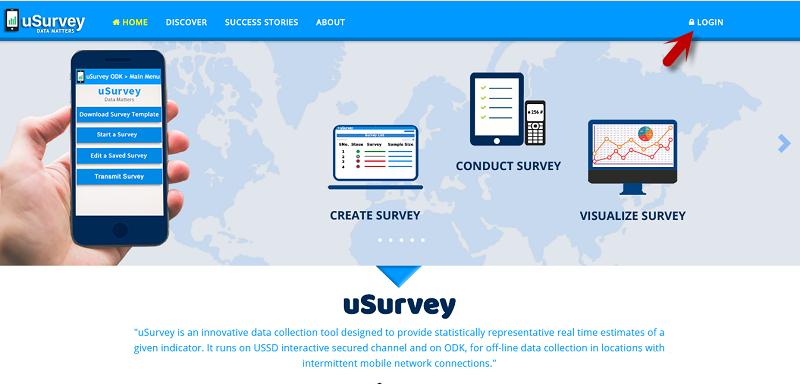

Now Sign in to the portal using your Username and Password, after successful login you will be navigated to uSurvey Dashboard, which shows Uganda Map.

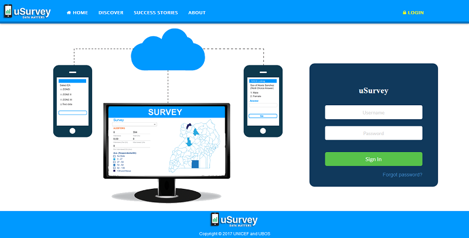

###Dashboard
------
The Dashboard, contains Survey Map, which is used to display survey report on a country map as per primary Administrative divisions. 
E.g. In current map of Uganda, every District correspond to primary administrative division for Survey.

Dashboard is basically divided into two Tabs  
1. **Locations**  
2. **Indicators**

On Map Dashboard, a drop down at top left contains Surveys, District wise completion rates with respect to its legend and respective Survey Indicators are display adjacent to the map.
Legend at bottom left, shows with color codes used to indicate completion status on map.

In the ‘Locations’ tab,  
select a Survey and point on relevant District on the map you wish to examine, then the report is loaded into the map and shows District wise Survey report with completion rates and completion status.

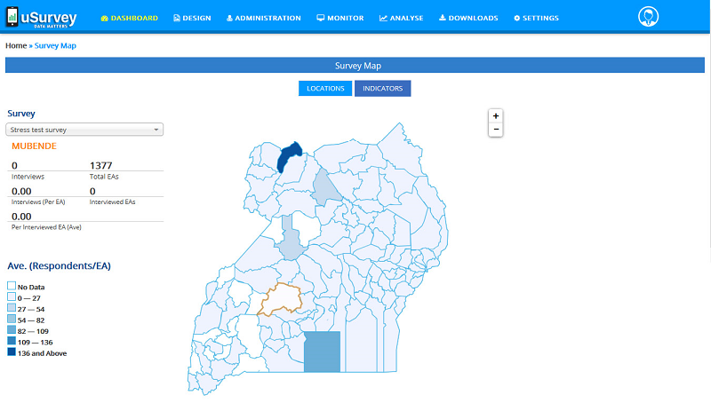
 
In the ‘Indicators’ tab, 
Shows maximum five Indicators that defined for each Survey. select a Survey and point on relevant District on the map you wish to examine respective Indicators.

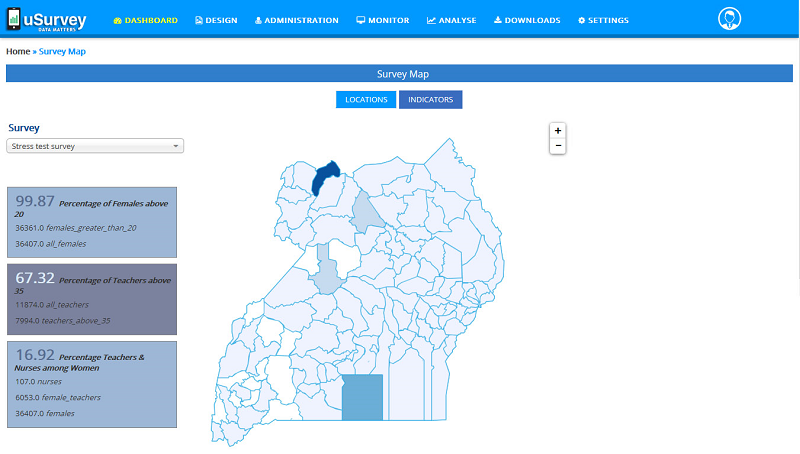

###Modules
------
Modules are Survey based classification based up on survey type and need.
Modules are accessible from main menu under, **Design** >> **Modules**

To create a new Module, click on ‘Add Module’ button at top right of the Modules page, that opens a form to create a new Module.

**Elements of Module**:

**Name**: Name of a Module, which is a unique identity to a Module and is a mandatory field.   

**Description**: A short description about Module

A Module is created by providing above field and click on ‘Create’ button to Create a Module. 

On the ‘Modules’ page you can view all the Modules created in the application. each of these Module has Actions to ‘Edit’ and ‘Delete’.

**Actions in Modules**:

* Edit Module: click on, Action Item ‘Edit’, User can Edit Name and Description of the Module. 
* Delete Module: click on, Action Item ‘Delete, the Module is removed, before deleting you will be prompted with conformation to delete, click ‘Yes’ to Delete permanently.

###Groups
------
Groups are Survey dependent classification of people/respondents based on their Age, Gender and combination of both into one or more survey- respondents categories called Groups.
Population has to be segment into Groups / multiple groups and our system allows us to create as many as needed.

From this above Groups page, Groups are managed, i.e. to Create a New Group, Edit existing Group, Delete Groups and Manage Parameters

**Create a New Group**

Groups are accessible from main menu under, **Design** >> **Groups**

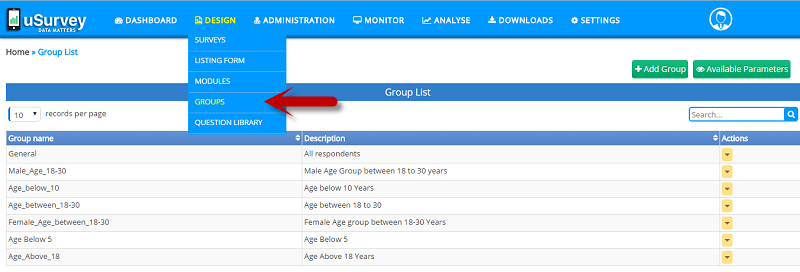

To create a new Group, click on ‘Add Group’ button at top right of the Groups page, that opens a form to create a new Group.

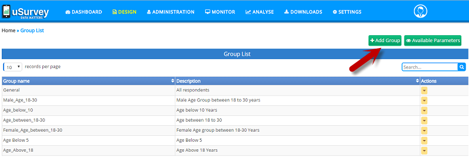

**Elements of Group**

**Name**: Is Group Name, which is a unique identity to a Group and is a mandatory field.   

**Description**: A short description about Group

**Parameter**: Need to select a parameter, based on which Group is created. Like Age, Gender  

**Operator**: Also need to select an Operator based on the Parameter value, like value starts with, equals to and between, etc.

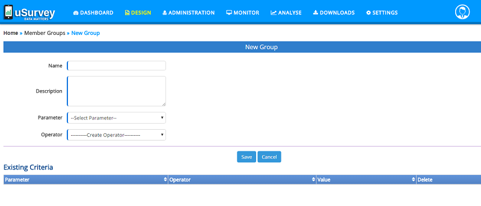

A Group is created by providing above all field, such that a Group can be created using a single or combination of Parameters, finally click on ‘Save’ button to Create Group. 

**Existing Criteria**
This table shows list of parameters used in creating a Group and can be altered by Deleting the existing one and assigning a different parameter to the same Group Name, by changing the ‘Parameter’ and ‘Operator’ values, then click ‘Save’ button.

**Edit and Delete Groups**
From the Groups Table each of the Group has Action items to ‘Edit’ and ‘Delete’ Group.

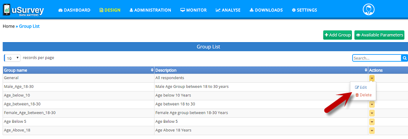

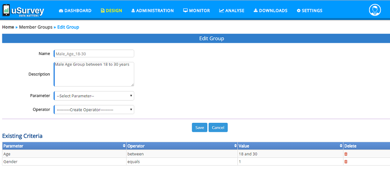

To Edit a Group – In the table under column name ‘Actions’ select ‘Edit’ to modify existing the criteria, name, description, then click ‘Save’ button.

To Delete a Group – In the table under column name ‘Actions’ select ‘Delete’ to remove from list, before deleting you will be prompted with conformation to delete, click ‘Yes’ to Delete permanently.

**Available Parameters**

Parameters plays a major portion in creating a Group, to check what are the Parameters available, Add, Edit and Delete Parameters are managed.

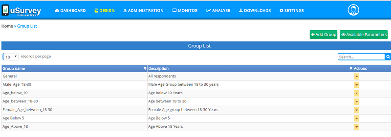

**Add Parameters**

To Add Parameter, click on ‘Add Parameter’ button at top right of the Parameter page, that opens a form to create a new Parameter, which has following elements;

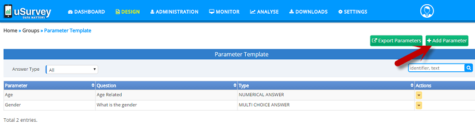

**Elements of Parameter**

**Variables Name**: Is an identifier for Parameter, Enter the name of the Parameter 

**Text**: A short description about Parameter

**Answer Type**: Select an Answer Type for Parameter from dropdown list, such that Parameter is of type Text, Numeric and Multi choice.

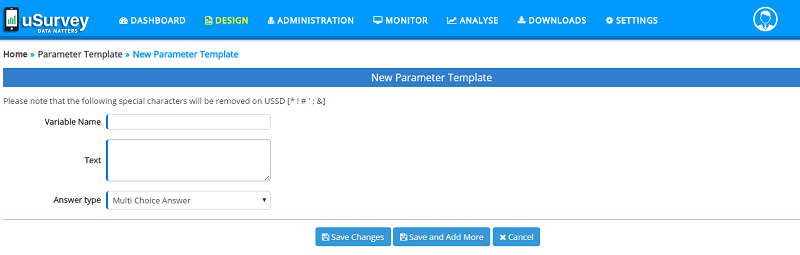

A Parameter is created by providing above all field, finally click on ‘Save’ button to Create Parameter or click on ‘Save and Add More’ button to continue adding more Parameters to the list.

**Edit and Delete Parameter**
From the Parameter Table each of the Parameter has Action items to ‘Edit’ and ‘Delete’ Parameter.

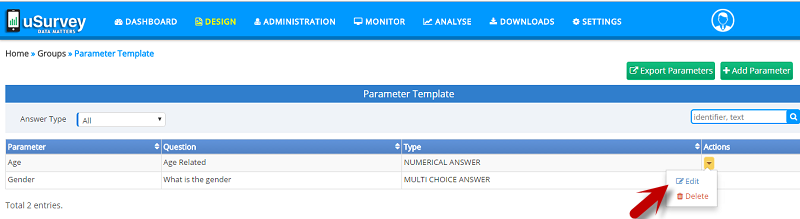

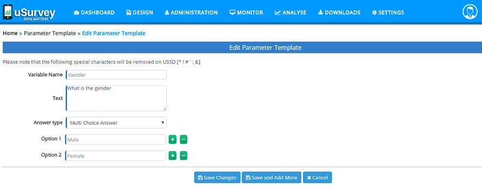

To Edit a Parameter – In the table under column name ‘Actions’ select ‘Edit’ to modify existing the Variable name, Text and Answer Type, then click ‘Save’ button.

To Delete a Parameter – In the table under column name ‘Actions’ select ‘Delete’ to remove from list, before deleting you will be prompted with conformation to delete, click ‘Yes’ to Delete permanently.

**View Options**: This Action item is visible only for the Questions that has Answer Type “Multi choice”, to view Answer Choices.

**Export Parameter**
Click on ‘Export Parameter’ to download available list of Parameter in ‘.CSV’ file format.

###Listing
------
The Listing is generally carried out by field staff other than interviewers, as a separate field operation conducted before the survey starts. This pre-process has the following benefits

1. It creates set of common questions to be asked before any survey is captured, as a one-time effort. For instance, the demographic details of household residents is required before conducting any household survey. Such data can be captured as part of the Listing.

2. By creating a separate Listing the system gives the user flexibility to use the same Listing for multiple surveys.

Listings are accessible from main menu under **Design** >> **Listing Form**

Listing is a set of Questions that can be customized/configured for any survey by reusing same Listing.

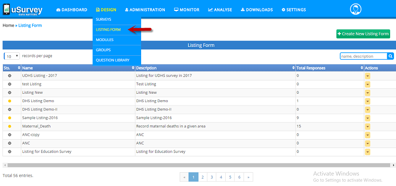

**Creating New Listing**

To create a new Listing, click on the ‘Create New Listing Form’ button at top right of the Listing page, that opens a form to create a new Listing, which has following elements; 

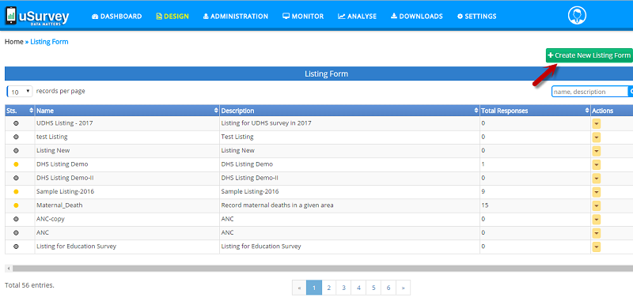

**Elements of Listing form**:

* **Name**: Is Listing Name, which is a unique identity to a Listing and is a mandatory field.

* **Description**: write about the importance of the Listing in short.

* **Access channels**: This will identify on which channel this survey has to be conducted and has two channel ODK and USSD

A Listing Form is created by filling above all fields, finally clicking on ‘Save’ button to create Listing.

**Search**: One can find Listings in the application, using the search bar at top right side of this Listing Form page, by providing Name or description.
  
On the ‘Listing Form’ page one can view all the Listings created in the application, in a tabular form with following column names:

**Sts**: Represents Status of the Listing by color indicator, that means each of the Color code indicates as:

 •– Not Started 
 •– Ongoing 
 •– Completed 

**Name**: Is Name of the Listing, which is a unique identity to represent Listing and is a mandatory field.   

**Description**: A short description about Listing

**Total Respondents**: once the listing operation is completed, this column will be updated with the count of participants/ respondents.

**Action**: Each of the Listing has following Actions: ‘Edit’, ‘Delete’, ‘View/Edit Questions’, ‘View Data’ and ‘Clone’

**Actions in Listing Form**:

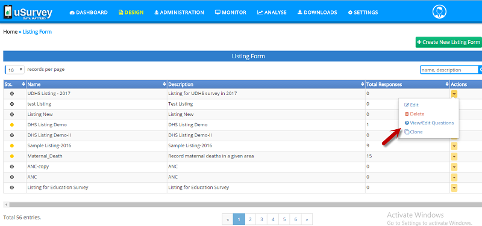

* **Edit**: click on, Action Item ‘Edit’, User can Edit only the name of the Listing, Description and selection of Access channels (OBK, USSD)

* **Delete**: click on, Action Item ‘Delete, the entire Listing is removed, before deleting you will be prompted with conformation to delete, click ‘Yes’ to Delete permanently. 
This option is not available for completed listing

* **View/Edit Questions**: click on, Action Item ‘View/Edit Questions’, navigates to ‘Listing Questions’ page to View or Edit Respective Questions in Listing

* **Clone**: click on, Action Item ‘Clone’, an another copy of same Listing Form is created along with Listing Questions, except existing Looping and Logic

* **View Data**: This Action Item is available only for the completed Listing operation in the field.  click on, Action Item ‘View Data’, to view data collected for this particular Listing

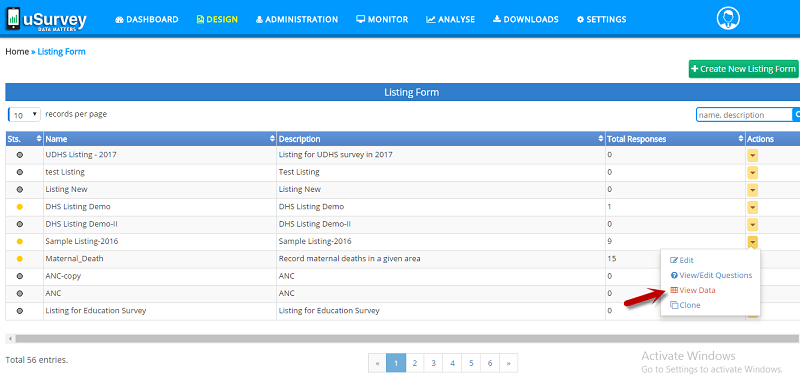

**Creating Questionnaire to the Listing Form**: 

On the ‘Listing Form’ page you can view all the Listings created in the application. 

To add new questions in Listing can be done in 2 ways

1. Click on the Listing Name
2. Click on Actions Drop down and select the item ‘View/Edit Questions’

One can also select the questions from ‘Questions Library’ to add into Listing, using ‘Select Questions’ 

**Add Questions in Listing Form**:

Click on, ‘Add Question’ button at top right of the particular Listing page, this will open a form where one can create a Question, which has following elements; 

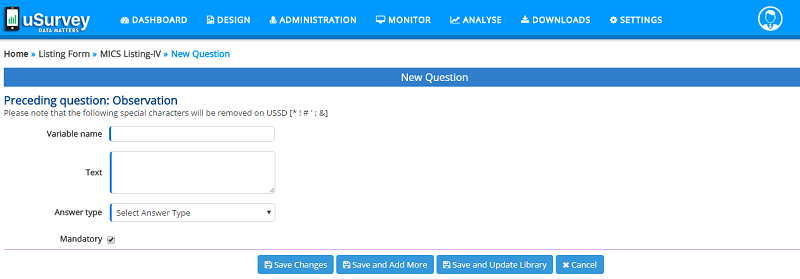

**Elements in Listing Question form**:

**Variables Name**: This is an identifier for Question, type a code for Question

**Text**: Is the actual Question, Write a Question. While typing a question, auto suggestion feature is available, which will prompt with the ‘Variable Name’ of preceding questions, that helps to include “answered text of preceding question” in framing this question. 
i.e. just type, double curly brackets to automatically prompt with the ‘Variable Name’ from preceding questions, 
Ex: type {{ , system prompts with ‘Variable Name’ then select any one to insert Variable Name, 
Like: {{structure_address}}
 
**Answer Type**: Select an Answer Type from dropdown list, such that Question has to be answered in any one of these formats only, that is ‘Answer type’ should be: “Audio, Auto Generate, Date, Geo Point, Image, Multi choice, Multi Select, Numeric, Text and Video”

**Mandatory**: To mark the Question, that has to answered compulsory. 

A Question in Listing is created by filling above all fields, finally click on ‘Save’ button to Add Question in Listing or click on ‘Save and Add More’ button to continue adding another Question to the same Listing or click on ‘Save and Update Library’ to add same to the ‘Questions Library’.

**Select Question**: On click, ‘Select Question’ button, User navigates to ‘Select Library Questions’ page where one can Add the Library Questions into Listing. 

To Add Question from Library to Listing, just Click on “Code” or “Text” to move Question between (Library Questions << / >> Listing Questions) tables, then click on ‘Save’ button at bottom of this page, to finish adding Questions to Listing.

**Search**: One can find Questions in Library by two ways:
**Sort** questions using ‘Answer Type’ dropdown at top left side of this page. Or
**Search** using the search bar at top right side of this page, by providing text or code.

**Export Questions**: On click, ‘Export Questions’ button, user can download the Listing Questions in “.csv” file format.

**Update Question Order**: 
Questions in the table can be rearranged. 
To change the order of the Question in table, just select the Question then drag (move up or down) and drop at new position/order you want to in the table, then click on ‘Update Question Order’ button at bottom of the Questions table.

On the ‘Listing Questions’ page one can view all the Questions created in that particular Listing.

**Search**: One can find Questions in Listing by two ways: 
**Sort** questions using ‘Answer Type’ dropdown at top left side of this page. Or 
**Search** using the search bar at top right side of this page, by providing text or code.

**Actions for Listing Questions**:

**Edit Question**: click on, Action Item ‘Edit’, User can Edit respective Question, ‘Variable Name’, ‘Text’ (Question), ‘Answer Type’ and can change ‘Mandatory’ type.

**Insert Question**: click on, Action Item, ‘Insert Question’ using which User can insert a New Question below the respective Question and rest of the process is similar to ‘Add New Question’.

**Delete Question**: click on, Action Item ‘Delete’, the Question is removed from list, before deleting you will be prompted with conformation to delete, click ‘Yes’ to Delete permanently.

**Caution while deleting a Question**: when a user attempts to delete a question, if that particular question is assigned with Logic or Loop, then along with the question logic or entire loop is removed respectively. 

**View Options**: This Action item is visible only for the Questions that has Answer Type “Multi choice” and “Multi Select”, to view Answer Options.

**Start/Edit Loop**: 

‘Start/Edit Loop’ is an Action item available only for the Questions that has Answer Type “Auto Generated”. 

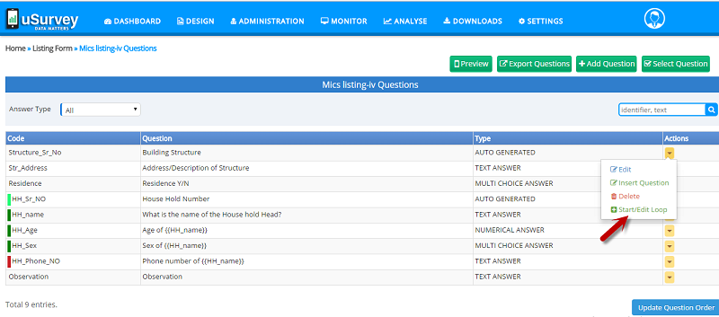

Looping means repeatedly asking set of questions based up the need and purpose of the base question.  

To define the Looping concept, first of all one has to understand about terms that are used in creating a Loop are as following:

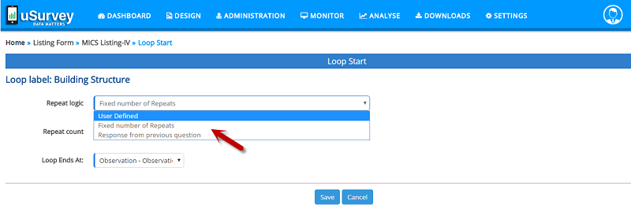

**User Defined**: Need to choose what set of Question come into loop, starting from this particular question and has to end loop with any of the consecutive question in the Listing. 

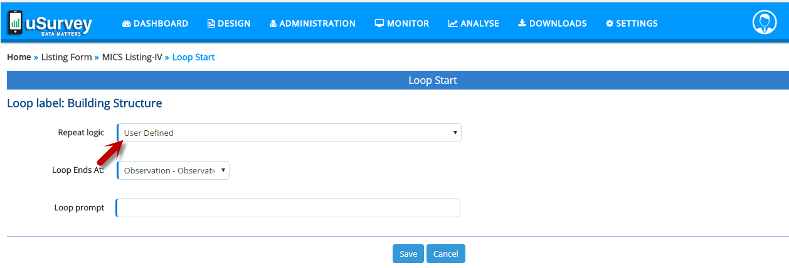

**Repeat Logic**: To apply Looping for a question there should be some base criteria to start loop, that is chosen from ‘Repeat Logic’ as “User Defined”, “Fixed number of repeats” and “Response from previous question”

**Fixed number of repeats**: Is chosen, need to provide ‘Repeat count’ – any specific no of times loop to be repeated.

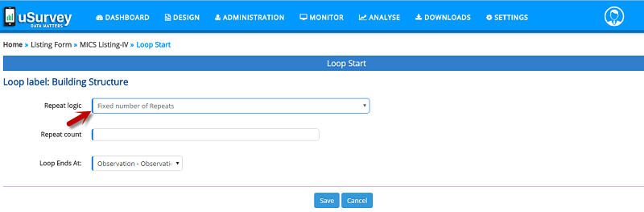

**Response from previous question**: Is chosen, only when a question that exists before this base question with Answer Type “Numerical Answer”. This logic is based up on numeric value provided in the previous question.

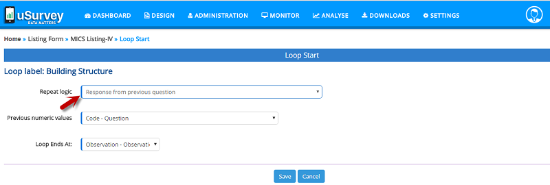

* **Loop Ends At**: When a loop starts that has to be closed, here the choice at which question the loop as to be closed is selected.  

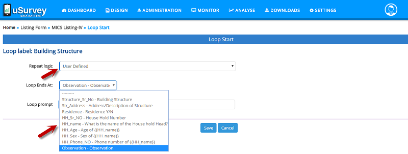

* **Loop Prompt**: This is a message prompt shown on Mobile App during the time of capturing this details. This message will help the Interviewer to proceed further.

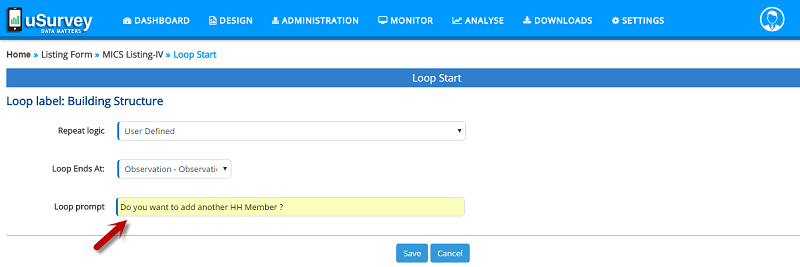

**How to create a Loop?**

One should be very careful while creating a loop, first of all analyze how a loop has to be created, using ‘Repeat logic’ and where to ‘End Loop’, as defined above select accordingly from ‘Repeat logic’ and ‘Loop end at’ to define a loop.

click on, Action Item ‘Start/Edit Loop’ which will take to ‘Start Loop’ page, now create loop as follows:

* select “Logic Type” from dropdown ‘Repeat logic’,
* select “Question at which loop should end” from dropdown ‘Loop end at’ and
* in ‘Loop Prompt’ Text Box, write some message about, instructing the loop flow,
* then click on ‘Save’ button to create loop

Now you will be viewing a looping representation on ‘Listing Questions’ page in the ‘Code’ column of the ‘Questions’ table 

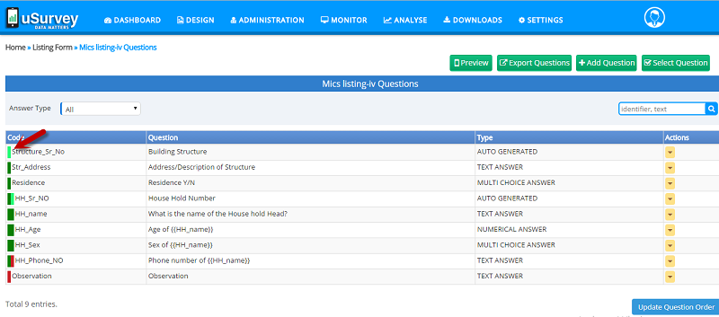

**Loop Representation**:

*  |  - icon represents Loop - START,

*  |  - icon represents Loop - END,

*  |  - icon represents Loop - CONTINUATION

**Remove Loop**:

This Action item available only for the Questions that has Answer Type “Auto Generated” and a Loop is created.
click on, Action Item ‘Remove Loop’ which will remove the existing looping logic.

**Add Logic**: 

‘Add Logic’ is an Action item for every question expect for the Questions that has Answer Type “Auto Generated”.

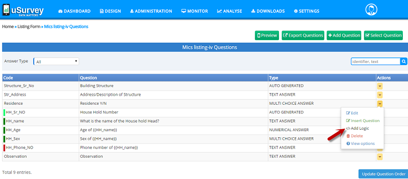

Add Logic option will convert a question to conditional one such that question will have choices to “Reconfirm”, “End Interview”, “Ask Sub-Question” and “Skip To” which is based up on value/Answer provided.

one has to define the Logic here for respective question by satisfying the condition by providing ‘Eligible Criteria’, ‘Attribute’ Value, and ‘Then’ as follows:

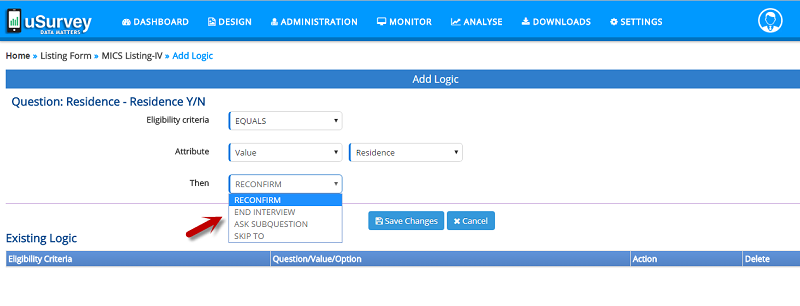

**Eligible Criteria**: This is a condition made based up on this Question value “Starts With”, “Equals”, “Contains” and “Ends With”.

**Attribute**: Provide the “Value” as per the above ‘Eligible Criteria’ selected

**Then**: Based up on the ‘Eligible Criteria’ and ‘Attribute’ Value chosen, the condition for Question is applied here with following options:
  
* ‘Reconfirm’ – Prompts with conformation Question to validate the Answer 

* ‘End Interview’ – Skips the intermediate Question and moves to end of the questioner.
 
* ‘Ask Sub-Question’ – Provides an option to Create a Sub-Question based upon the ‘Attribute’ value. 

To do this, select option “Ask Sub-Question” than you will find a button with name ‘Add Sub-Question’ beside this,  
click on it to create a Sub-Question, same like create question, once you click on ‘Save’ button, you will find this Sub-Question in the dropdown ‘Choose Question’ 
beside it, now select the “Sub-Question” and click on ‘Save’ button.
 
* ‘Skip To’ - Provides the option to jump to any particular/ consecutive question in the list, by skipping / avoiding the intermediate Question. 

**How to Apply Logic to a Question?**

Click on, Action Item, ‘Add Logic’ this will open a form where one can create a Logic for Question, by providing ‘Eligible Criteria’, ‘Attribute’ Value, and ‘Then’ as per the condition required, then click on ‘Save’ button to create Logic.  

In the same page, logic that is created can be seen in table “Existing Logic”.
Which shows the created logic for this particular question and has option to ‘Delete’ the applied Logic

**Edit Logic**: 
In the ‘Listing Form Questions Template’ page, Questions that has Logic are represented with hyperlink, click on the respective Question, that shows options to ‘View logic’, ‘Edit’ and ‘Delete’

* **View Logic**: click to view the Logic that is Applied for this particular question

* **Edit Logic**: click to Edit the existing Logic that is Applied for this particular question

* **Delete Logic**: click to Remove the Logic that is Applied for this particular question

###Create Survey
------
Surveys are accessible from main menu under **Design** >> **Surveys**

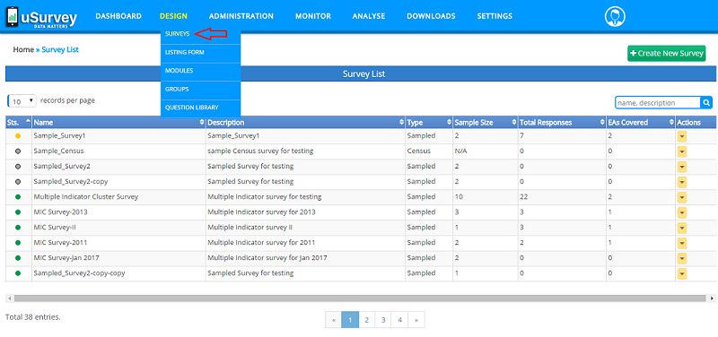
Screen-1

A New Survey can be created and defined here, so before creating a survey first of all one has to know about the terminology used here.

* **Preferred Listing**: List of existing Listing, which are already in the system. 
Is an option to choose, existing Listing for this New Survey, where already survey was conducted on these Listings, which will include total Listing questions along with the data/results.

* **New Listing**: List of Newly created Listings, not previously used in any survey. 
This field will enable only if option “None, Create New” is selected, in the dropdown ‘Preferred Listing’. which contains list of Newly created Listings, which are not yet used in any survey.

* **Randomly selected data label**: Is the identifier for respondents while conducting a Listing survey.
  This field will enable only when listing in dropdown ‘New Listing’ is selected.

**How to create a Survey?**
To create a New Survey, click on ‘Create New Survey’ button at top right of the Survey page, that opens a form to create a new Survey, which has following elements;

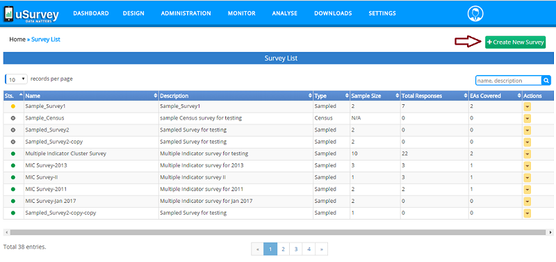
Screen-2

**Elements of a Survey**:

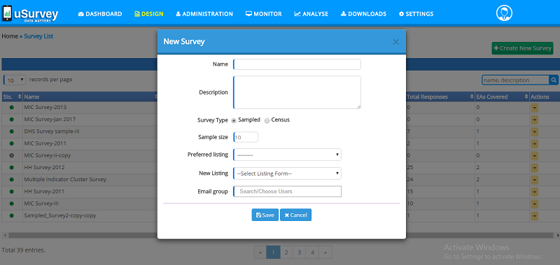

* **Name**: Is Survey Name, which is a unique identity to a survey and is a mandatory field 
* **Description**: write about the importance of this survey in short 
* **Survey Type**: This identifies how survey is going to take place either using Listing or not 
    If Survey Type is “Sampled”, Survey uses Sample size and Listing  
    If Survey Type is “Census”, Survey doesn’t need Sample size and Listing

* **Sample size**: Provide survey sample size 
* **Preferred Listing**: select an existing Listing Or 
* **New Listing**: select Newly created Listing 
* **Randomly selected data label**: You need to include one listing response identifier in double curly brackets. 
 i.e. just type, double curly brackets to automatically insert ‘Variable Name’ in above selected Listing 
 Ex: type {{ , system prompts with ‘Variable Name’ then select any one to insert Variable Name 
 Like: {{house_number}}  
* **Email group**: select, User Emails Id to send report  

A New Survey is created by providing above fields and click on ‘Save’ button to Create a Survey. 

**Search**: One can find Surveys in the application, using the search bar at top right side of this survey page, by providing Name or description.

On the ‘Survey’ page one can view all the Survey created in the application, in a tabular form with following column names:

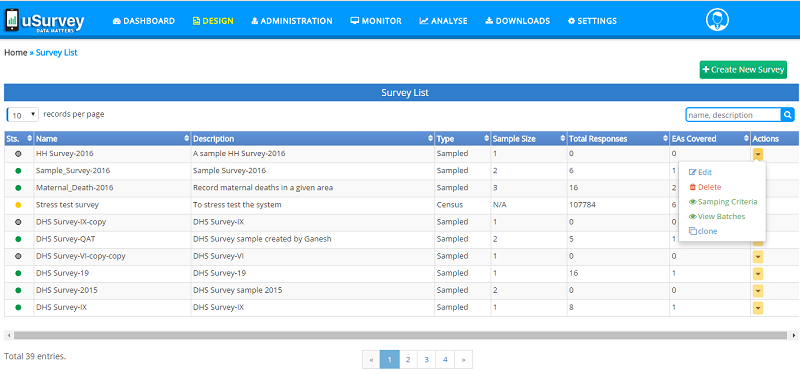

**Sts**: Represents Status of the Survey by color indicator, that means each of the Color code indicates as:
 • – Not Started 
 • – Ongoing 
 • – Completed 

* **Name**: Is Name of a Survey, which is a unique identity to represent Survey and is a mandatory field. 
* **Description**: A short description about Listing 
* **Type**: Survey type Sampled or Census 
* **Sample size**: Provide survey sample size 
* **Total Respondents**: once the Survey is completed, this column will be updated with the count of participants/ respondents. 
* **Eas Covered**: Count of Enumeration areas covered in this particular survey.

**Actions in Survey**:

* **Edit Survey**: click on, Action Item ‘Edit’, User can Edit all fields in the Survey 
* **Delete Survey**: click on, Action Item ‘Delete, the entire Survey is removed, before deleting you will be prompted with conformation to delete, click ‘Yes’ to Delete permanently.   This option is not available for completed Survey 
* **View Batches in Survey**: click on, Action Item ‘View Batches’, navigates to ‘Survey Batches’ page 
* **Clone a Survey**: click on, Action Item ‘Clone’, an another copy of same Survey is created along with Survey Batches and Batch Questions, except existing Looping and Logic in Batch Questions 
* **Sampling Criteria**:
  This feature helps Data researcher to sort collected data for sampling according to listing data, in some cases, the Data researcher might be interested in restricting sampling, so that only listing data which meets specific criteria are sampled.

For example: if interviewer had collected data for houses in a particular Enumeration area, the Data researcher might be interested in sampling only those houses with at least one child. Or
Data researcher might be interested in sampling only residential houses.

Defining Sampling Criteria provides the admin user to describe how to define the rules for Sampling Criteria

**Define Sampling Criteria**

To define Sampling Criteria, click on, Action Item ‘Sampling Criteria’, that opens a form with the following elements;

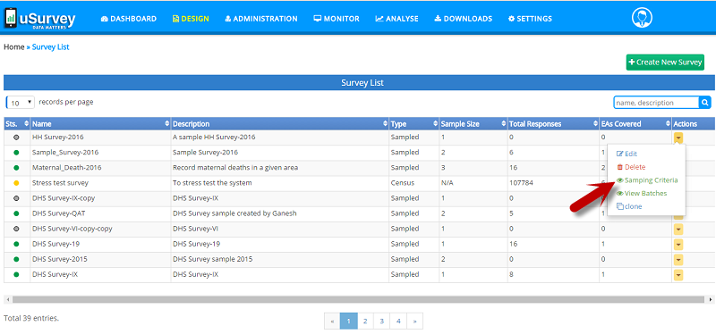

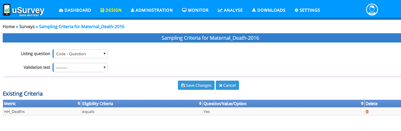

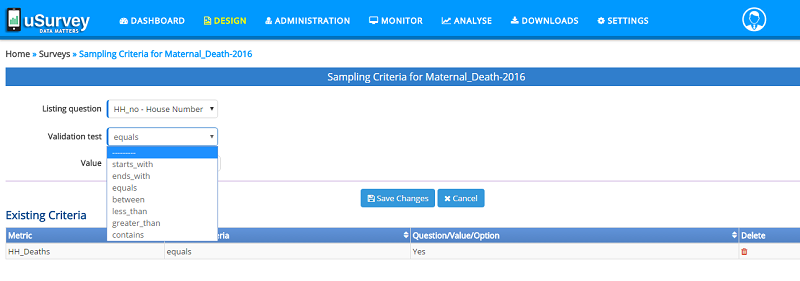

**Listing Question**: Listing Questions with code, used for this Survey are lorded here, one can select respective question for defining the Sampling Criteria.

**Validation Test**: Based on the above selected question, choose the eligible criteria to validate the collected data 

**Value / Options**: To sort collected data for sampling, provide valid input for above Validation Test.

Sampling Criteria is created by satisfying above fields, then click on ‘Save Changes’. 

In the same page, Sampling Criteria that is created can be seen in table the “Existing Criteria”.
Which shows the defined Sampling Criteria and has option to ‘Delete’.

###Batches
------
Batch is a categorization of Survey Questions, that means set of Questions categorized for a Survey convenience. We can create multiple Batches in a survey.

Once the Survey is created, next step is to create ‘Batch’ and ‘Add Questions’ to Batch.

**How to create a Batch?**

Go to Batches Page, which can be done in two ways
On the ‘Survey’ page you can view all the Survey created in the application
Now click on Survey Name, or click on, Action Item ‘View Batches’ to go to ‘Batches’ Page

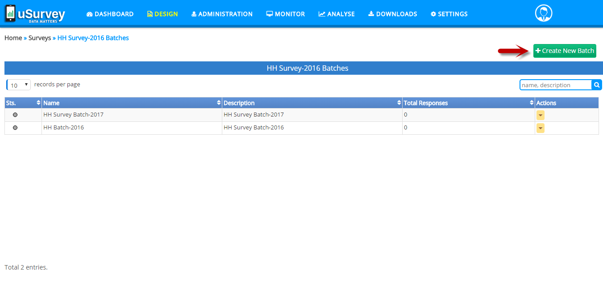

To create a New Batch, click on ‘Create New Batch’ button at top right of the Batch page, that opens a form to create a new Batch, which has following elements;

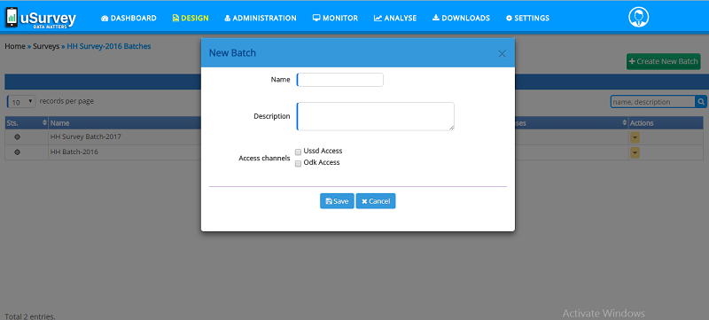

**Elements of a Batch**:

* **Name**: Is Batch Name, which is a unique identity to a Batch and is a mandatory field
* **Description**: write about the importance of this Batch in short
* **Access channels**: This will identify on which channel this survey has to be conducted and has two channel ODK and USSD

A New Batch is created by providing above fields and click on ‘Save’ button to Create a New Batch in Survey. 

**Actions in Batch**:

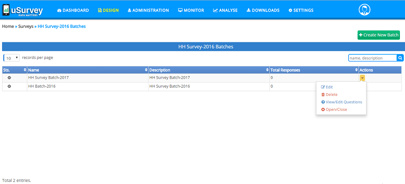

* **Edit**: click on, Action Item ‘Edit’, User can Edit all fields in a Batch
* **Delete**: click on, Action Item ‘Delete, the entire Batch along with questions are removed, before deleting you will be prompted with conformation to delete, click ‘Yes’ to Delete permanently. This option is not available for completed Surveys 
* **View/Edit Questions**: click on, Action Item ‘View /Edit Questions’, takes to the Survey ‘Batch Questions’ page
* **View Data**: click on, Action Item ‘View Data’, shows Data collected in this Survey. This option is available only for completed Surveys.

######Enable Batch
* **Open/Close**: To enable Batch for data collection  
click on, Action Item ‘Open/Close’, takes to the page where all Enumeration Areas are listed, here one can change the “status of conducting survey in a particular Enumeration Area” to Open/Close 
i.e. **Open** - means, enable Batch for data collection and **Close** – means, disable Batch for data collection.

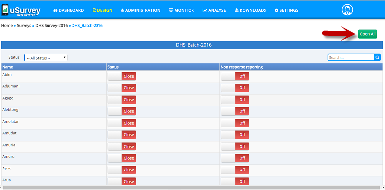

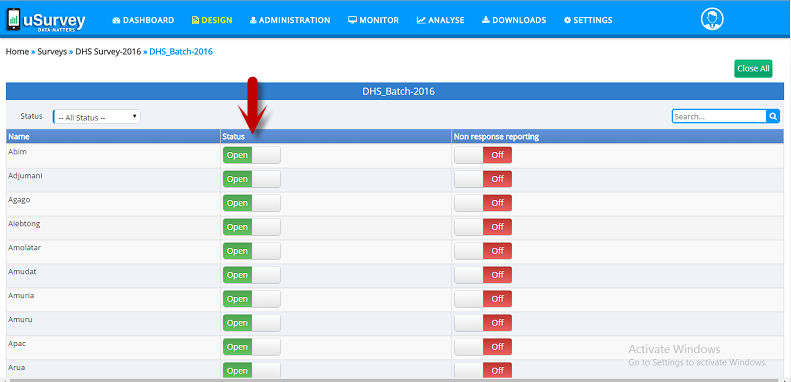

**How to create Batch Questions?**

Once Survey and Batches are created, next step is to ‘Add Questions’ to Batch as follows:

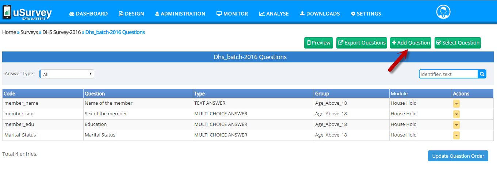

On the ‘Batch’ page you can view all the Batch created in a Survey
Now click on Batch Name, or click on, Action Item ‘View /Edit Question’ to go to ‘Batch Questions’ Page

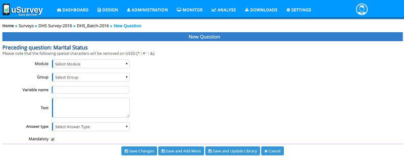

Now click on, ‘Add Question’ button at top right side of this page, this will open a form where one can create a Question, which has following elements;

**Elements in Batch Question form**:

* **Module**: All Modules in the application are listed here in this dropdown, one has to select, respective Module that is related to survey 
* **Group**: All available Groups are listed in this dropdown, select relevant group name for the question 
* **Variables Name**: This is an identifier for Question, type a code for Question 
* **Text**: Is the actual Question, Write a Question. While typing a question, auto suggestion feature is available, which will prompt with the ‘Variable Name’ of preceding questions, that helps to include “Answered text of preceding question” in framing this question. 
i.e. just type, double curly brackets to automatically prompt with the ‘Variable Name’ from preceding questions,  
Ex: type {{ , system prompts with ‘Variable Name’ then select any one to insert Variable Name, 
Like: {{structure_address}}  
* **Answer Type**: Select an Answer Type from dropdown list, such that Question has to be answered in any one of these formats only, that is ‘Answer type’ should be: “Audio, Auto Generate, Date, Geo Point, Image, Multi choice, Multi Select, Numeric, Text and Video” 
* **Mandatory**: To mark the Question, that has to answered compulsory

A Question in Batch is created by filling above all fields, finally click on ‘Save’ button to Add Question in Batch or click on ‘Save and Add More’ button to continue adding another Question to the same Batch or click on ‘Save and Update Library’ to add same to the ‘Questions Library’.

**Select Question**: On click, ‘Select Question’ button, User navigates to ‘Select Library Questions’ page where one can Add the Library Questions into Batch. 

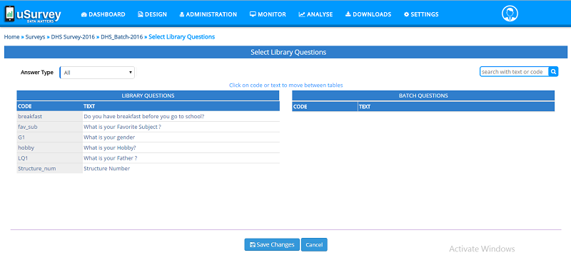

To Add Question from Library to Batch, just Click on “Code” or “Text” to move Question between (Library Questions << / >> Batch Questions) tables, then click on ‘Save’ button at bottom of the page, to finish adding Questions to Batch.

**Search**: One can find Questions in Library by two ways: 
**Sort** questions using ‘Answer Type’ dropdown at top left side of this page Or 
**Search** using the search bar at top right side of this page, by providing text or code

**Export Questions**: On click, ‘Export Questions’ button, user can download the Batch Questions in “.csv” file format.

**Update Question Order**: 
Questions in the table can be rearranged. 
To change the order of the Question in table, just select the Question then drag (move up or down) and drop at new position/order you want to in the table, then click on ‘Update Question Order’ button at bottom of the Questions table.

On the ‘Batch Questions’ page one can view all the Questions created in that particular Batch, 

**Search**: One can find Questions in Batch by two ways: 
**Sort** questions using ‘Answer Type’ dropdown at top left side of this page Or 
**Search** using the search bar at top right side of this page, by providing text or code.

**Actions for Batch Questions**:

* **Edit Question**: click on, Action Item ‘Edit’, User can edit respective Question, ‘Variable Name’, ‘Text’ (Question), ‘Answer Type’ and can change ‘Mandatory’ type. This option is not available and cannot be performed for completed survey.

* **Insert Question**: click on, Action Item, ‘Insert Question’ using which User can insert a New Question below the respective Question and rest of the process is similar to ‘Add New Question’.

* **Delete Question**: click on, Action Item ‘Delete’, the Question is removed from list, before deleting you will be prompted with conformation to delete, click ‘Yes’ to Delete permanently.

Caution, while deleting a Question: when a user attempts to delete a question, if that particular question is assigned with Logic or Loop, then along with the question logic or entire loop is removed respectively.

**View Options**: This Action item is visible only for the Questions that has Answer Type “Multi choice” and “Multi Select”, to view Answer Options.

**Start/Edit Loop**:
‘Start/Edit Loop’ is an Action item available only for the Questions that has Answer Type “Auto Generated”. 

Looping means repeatedly asking set of questions based up the need and purpose of the base question.  

To define the Looping concept, first of all one has to understand about terms that are used in creating a Loop are as following:

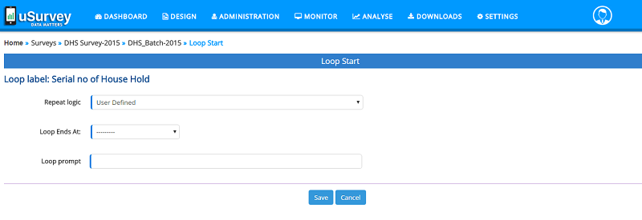

**Repeat Logic**: To apply Looping for a question there should be some base criteria to start loop, that is chosen from ‘Repeat Logic’ as “User Defined”, “Fixed number of repeats” and “Response from previous question”

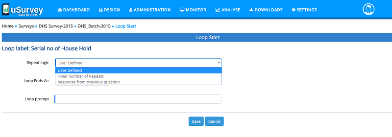

**User Defined**: Need to choose what set of Question come into loop, starting from this particular question and has to end loop with any of the consecutive question in the Batch.

**Fixed number of repeats**: Is chosen, need to provide ‘Repeat count’ – any specific no of times loop to be repeated. 

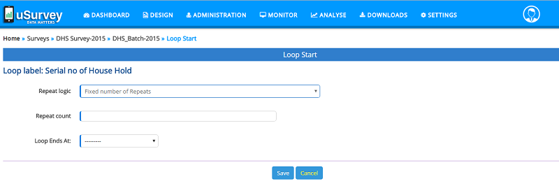

**Response from previous question**: Is chosen, only when a question that exists before this base question with Answer Type “Numerical Answer”. This logic is based up on numeric value provided in the previous question.

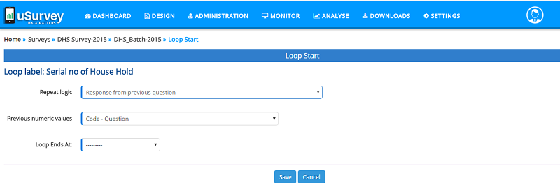

**Loop Ends At**: When a loop starts that has to be closed, here the choice at which question the loop as to be closed is selected.  

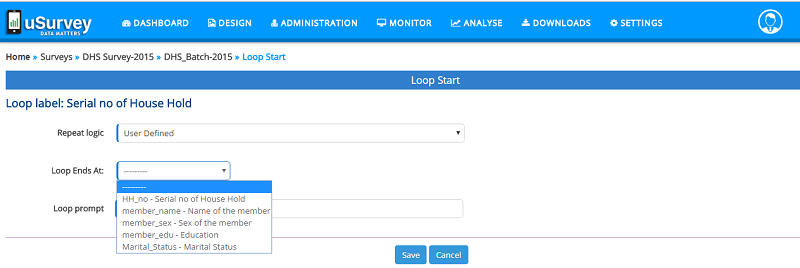

**Loop Prompt**: This is a message prompt shown on Mobile App during the time of capturing this details. This message will help the Interviewer to proceed further. 
Ex: “Do you what to Add one more”, “Do you what to Add another Household”, etc

**How to create a Loop?**

One should be very careful while creating a loop, first of all analyze how a loop has to be created, using ‘Repeat logic’ and where to ‘End Loop’, as defined above select accordingly from ‘Repeat logic’ and ‘Loop end at’ to define a loop.

* click on, Action Item ‘Start/Edit Loop’ which will take to ‘Start Loop’ page, now create loop as follows: 
* select “Logic Type” from dropdown ‘Repeat logic’, 
* select “Question at which loop should end” from dropdown ‘Loop end at’ and  
* in ‘Loop Prompt’ Text Box, write some message about, instructing the loop flow, 
* then click on ‘Save’ button to create loop. 
* Now you will be viewing a looping representation on ‘Batch Questions’ page in the ‘Code’ column of the ‘Questions’ table, 

**Loop Representation**:

*  |  - icon represents Loop - START,

*  |  - icon represents Loop - END,

*  |  - icon represents Loop - CONTINUATION

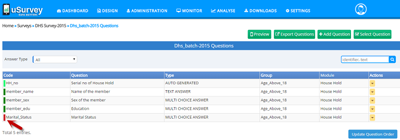

**Remove Loop**:

This Action item available only for the Questions that has Answer Type “Auto Generated” and a Loop is created.
click on, Action Item ‘Remove Loop’ which will remove the existing looping logic.

**Add Logic**: 

‘Add Logic’ is an Action item for every question expect for the Questions that has Answer Type “Auto Generated”.

Add Logic option will convert a question to conditional one such that question will have choices to “Reconfirm”, “End Interview”, “Ask Sub-Question” and “Skip To” which is based up on value/Answer provided.

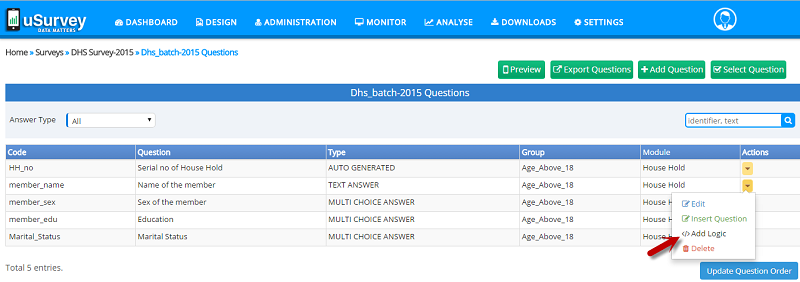

One has to define the Logic here for respective question by satisfying the condition by providing ‘Eligible Criteria’, ‘Attribute’ Value, and ‘Then’ as follows:

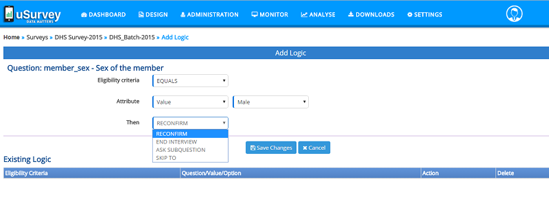

**Eligible Criteria**: This is a condition made based up on this Question value “Starts With”, “Equals”, “Contains” and “Ends With”.

**Attribute**: Provide the “Value” as per the above ‘Eligible Criteria’ selected

**Then**: Based up on the ‘Eligible Criteria’ and ‘Attribute’ Value chosen, the condition for Question is applied here with following options:

**Reconfirm** – Prompts with conformation Question to validate the Answer 

**End Interview** – Skips the intermediate Question and moves to end of the questioner

**Ask Sub-Question** – Provides an option to Create a Sub-Question based upon the ‘Attribute’ value. 
To do this, select option “Ask Sub-Question” than you will find a button with name ‘Add Sub-Question’ beside this, 
click on it to create a Sub-Question, same like create question, once you click on ‘Save’ button, you will find this Sub-Question in the dropdown ‘Choose Question’ 
beside it, now select the “Sub-Question” and click on ‘Save’ button.
 
**Skip To** - Provides the option to jump to any particular/ consecutive question in the list, by skipping / avoiding the    intermediate Question. 

**How to Apply Logic to a Question?**

Click on, Action Item, ‘Add Logic’ this will open a form where one can create a Logic for Question, by providing ‘Eligible Criteria’, ‘Attribute’ Value, and ‘Then’ as per the condition required, then click on ‘Save’ button to create Logic.  

In the same page, logic that is created can be seen in table “Existing Logic”.
Which shows the created logic for this particular question and has option to ‘Delete’ the applied Logic

**Edit Logic**: 
In the ‘Batch Questions’ page, Questions that has Logic are represented with hyperlink, click on the respective Question, that shows options like ‘View logic’, ‘Edit’ and ‘Delete’

* **View Logic**: click to view the Logic that is Applied for this particular question  
* **Edit Logic**: click to Edit the existing Logic that is Applied for this particular question  
* **Delete Logic**: click to Remove the Logic that is Applied for this particular question

###Library Questions
------
List of Questions very common in Surveys are available here which are also categorized into Module wise.  This is a feature/ facility available to pick up questions from this library and add to Batch or Listing, by ‘Select Questions’ feature in respective pages.

**Create Library Questions**

To add new questions in Library can be done in 2 ways.

1. Adding directly question to Library 
2. Using feature ‘Update Library’ while creating Batch or Listing Questions

Library Questions are accessible from main menu under **Design** >> **Questions Library**

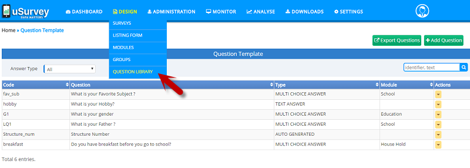

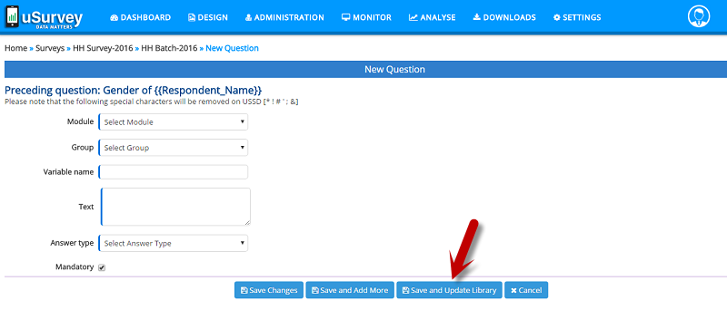

**Adding Directly**:
On the ‘Library’ page one can view all the list of Library Questions, 
Now click on, ‘Add Question’ button at top right side of this page, this will open a form where one can create a Question, which has following elements; 

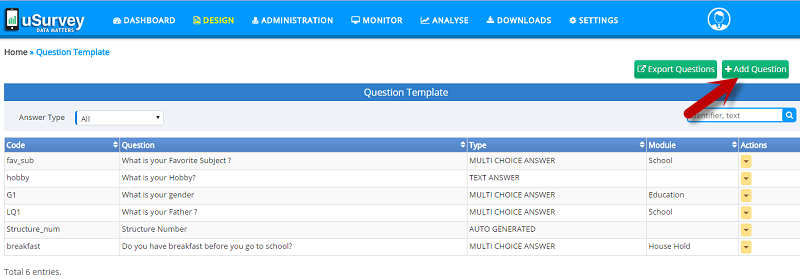

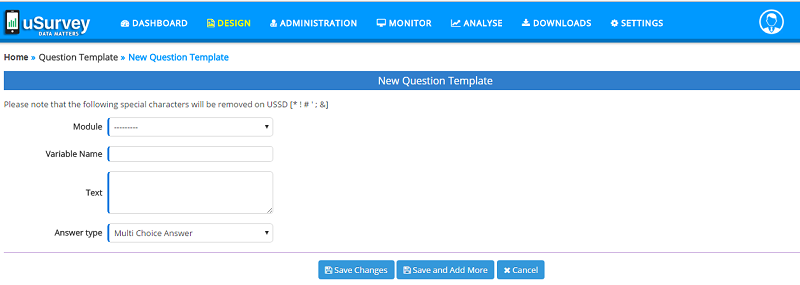

**Elements in Library Question**:

**Module**: All Modules in the application are listed here in this dropdown, one has to select, respective Module that is related to survey.

**Variables Name**: This is an identifier for Question, type a code for Question

**Text**: Is the actual Question, Write a Question.
 
**Answer Type**: Select an Answer Type from dropdown list, such that Question has to be answered in any one of these formats only, that is ‘Answer type’ should be: “Audio, Auto Generate, Date, Geo Point, Image, Multi choice, Multi Select, Numeric, Text and Video”

A Library Question is created by filling above all fields, finally click on ‘Save’ button to Add Question to Library or click on ‘Save and Add More’ button to continue adding another Question.

**Search**: One can find Questions in Library by two ways:
**Sort** questions using ‘Answer Type’ dropdown at top left side of this page. Or
**Search** using the search bar at top right side of this page, by providing text or code.

**Export Questions**: On click, ‘Export Questions’ button, user can download the Library Questions in “.csv” file format.

###Interviewer
------
Interviewer is a role in the system, one who conducts a Survey in the field.   
These Interviewers conducts the survey in the designated Enumeration areas and data collection is done using the hand-held mobile device like Android Smart Phone or Featured Phone using uSurvey App and USSD channels respectively.

Data researcher enrolls Interviewer, assigns Survey and allocates to the Enumeration areas.

Enrolled Interviewer are accessible from main menu under **Administration** >> **Interviewers**

**Interviewer Registration**

On the ‘Interviewers’ page one can view list of enrolled Interviewers in the application, also can Add and Manage Interviewers.

To register a new Interviewer, click on ‘Add Interviewer’ button at top right of the Interviewers page, this will open a registration form with following elements;

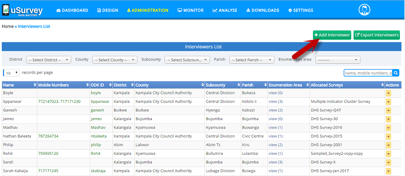

**Elements in the registration form**

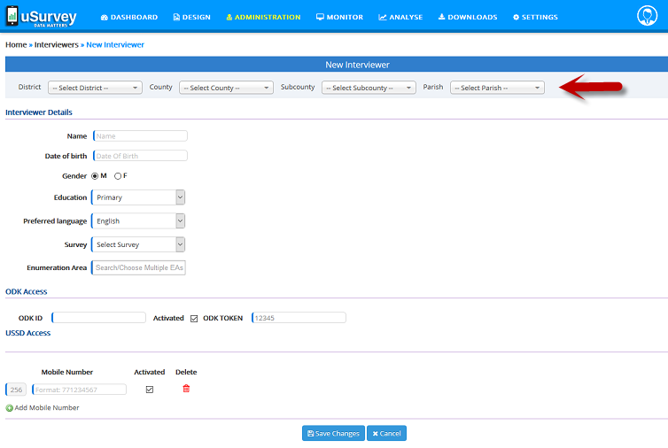

**Select Locations**: Initially get list of Enumeration Areas (EA) by selecting respective, District, County, Sub-county and Parish from locations filters at top of this page, to allocate Enumeration areas to the Interviewer where survey has to be conducted.

**Name**: Name of the Interviewer

**Date of Birth**: Date of birth of the Interviewer

**Gender**: Gender of the Interviewer

**Education**: Education qualification of the Interviewer

**Preferred Language**: select, Interviewer’s preferred language to write and speak

**Survey**: Assign a Survey to the Interviewer, select a Survey from the list

**Enumeration Area**: The places or locations where assigned Survey is supposed to be conducted by the Interviewer. 
To Search/choose EAs, at least a ‘District’ has to be selected from locations filters at top of this page, then EAs are available.

**ODK Access**: The process of collecting data using Android channel is known as ODK Access, to provide permissions to access this channel, an Interviewer needs following ODK Access credentials;

**ODK ID**: It is the User Id / User Name to access ODK channel, only alphabets are accepted

**ODK Token**: It nothing but password to access ODK channel, only numeric values are accepted

**Activated**: Allow access or prevent access to ODK channel

**USSD Access**: The process of collecting data using Featured Phone is known as USSD Access, to access this channel, an Interviewer needs to provide Mobile Number. 

**Add Mobile Number**: System facilitates, accessing from multiple mobile numbers also. So one can add multiple mobile numbers or remove here using ‘Add’ and ‘Delete’ options.

**Activated**: Allow access or prevent access to USSD channel

Interviewer is enrolled by providing above all field, finally click on ‘Save’ button to complete the process. 

In this page, Interviewers are also managed, i.e. to Edit Details and block/unblock Interviewer.

**Actions**:

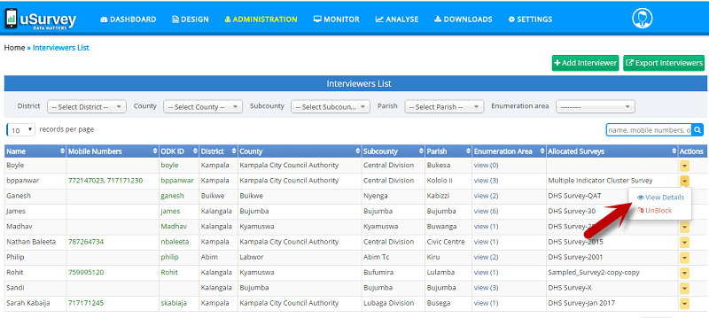

**View Details**: View Interviewer profile and Edit details, all profile details, Survey Details, ODK Access and USSD Access details can be modified, just click on ‘Edit’ button at the bottom of the page.

**Un Block/ Block**: Option to make Interviewer Active or In-Active to retain in the system.

**Search**: One can find Interviewers in system by two ways:
**Sort** Interviewers location wise by selecting respective, District, County, Sub-county and Parish using locations filters at top of this page. Or
**Search** using the search bar at top right side of this page, by providing Interviewer’s Name.

**Export Interviewers**: On click, ‘Export Interviewers’ button, user can download the Interviewers list in “.csv” file format.

###Indicators
------
A Data Researcher can choose one or more fields from their survey and create an arithmetic expression to generate metrics as per their requirement. Each such expression is called an Indicator. Any number of indicators can be created for a Survey. A limited number of these indicators can be selected to be shown on the dashboard.  
Our system facilitates creating customized Indicators for every survey and show an analysis report in tabular and bar chart form.

**How to create an Indicator?**

On the ‘Indicator’ page one can view list of all survey wise Indicators in the application and can view analysis report.

To create an Indicator, click on ‘Add Indicator’ button at top right of the Indicator page, this will open a blank form with following elements;

**Elements in the Indicator form**

**Survey**: Select Survey from list, for which the Indicator need to be defined.

**Listing**: Select respective Listing, for which the Indicator need to be defined.

**Indicator**: Give a name to the Indicator   

**Description**: A short description about Indicator
 
**Variables**: To create an Indicator, certain metrics are needed for calculation, which are derived from survey/ listing questions   

**Formulae**: compose a formula based up on available Variables,  
Auto suggestion feature is available, which will prompt with the ‘Variables’ already defined above for composing.  
i.e. just type, double curly brackets to automatically prompt with the ‘Variables’ already defined,  
Ex: type {{ , system prompts with ‘Variables’ then select any one to insert Variable,  
Like: {{hh_age}}  

**Display on dashboard**: This option allows the indicator to be displayed on the dashboard. A user can select a maximum of 5 indicators to be shown on the dashboard.

**Add Variable**: 

To Add a Variable, click on respective ‘+’ icon adjacent to ‘Variables’ Text box, that opens form to define a Variable, following parameters are involved and expressed.

**Name**: Define a name to the Variable

**Description**: A short description about Variable

**Test question**: Select respective Listing questions, for which the Variable need to be defined.

**Operator**: Select respective operator based up on the value of the above ‘Test question’

Once all the above fields are filled, then click on ‘Add’ button to add to below table ‘Settings for this Variable’, since you can add more Variables for combination, once all Variables are defined then, finally click on ‘Save’ button to add to Variables list.

One can also ‘Edit’ and ‘Delete’ Variables using the respective icons adjacent to ‘Variables’ Text box.

Once Variables are defined, now you can compose the formula in ‘Formulae’ Text box, the composed formula is validated automatically and a message is shown here as ‘Valid’ or ‘in valid’.

Once Variables are defined, formula is composed and validated, finally click on ‘Save’ button to create an Indicator.

On the ‘Indicator’ page one can view all the Indicator created in the application, in a tabular form with following column names:

**Sts**: Represents Indicator display status on dashboard, that means status with color code indicates as:

 • – Not Displayed 
 • – Displayed 

**Indicator**: Is the title of Indicator, which is a unique identity to represent Indicator of a Survey.

**Description**: A short description about Indicator

**Survey**: Name of the Survey to which this Indicator belongs

**Batch**: Name of the Survey Batch to which this Indicator belongs

**Actions**: 

* **Edit**: click on, Action Item ‘Edit’, User can Edit all fields in Indicator.
* **Delete**: click on, Action Item ‘Delete’, the Indicator is removed, before deleting you will be prompted with conformation to delete, click ‘Yes’ to Delete permanently
* **Formula**: click on, Action Item ‘Formula’, to edit the Indicator Formula directly
* **Analysis**: click on, Action Item ‘Analysis’, navigates to ‘Indicator Analysis’ page, here one can view two forms of district wise reports based up on the Indicator Formula,
  * A Bar chart report is generated and displayed
  * A tabular report

###Manage Users
------
This section allows to add additional administration users to uSurvey. 
Portal Users’ enrollment is done here by Administrator, this system is developed in the model of ‘Role-based User access’, hence in the system we will find different ‘Roles’, based on application access privileges, these roles are defined. In this context, based on the ‘Roles’ of individual ‘Users’ access to perform a specific task, such as view, create or modify a form are given.

######Roles in the System
**Administrator**: Granted full access to View, Add, Edit and Delete in entire application, including creating the users, uploading the location and also clear the data of any Survey/ Listing using ‘Power Mode’, etc. 
**Please note**: This Role is very powerful and one should be very careful while allocation

**Data collector**: Have permission to View access only, but cannot create new Listing/Survey or any other new records.

**Data Email Reports**: System will send daily email report of the latest data collected for the last day. who can also monitor the data on the Portal. 

**Researcher**: Have permission to View, Add and Edit Interviewer, Listing, Survey, Group, Module and create questionnaire.

**Supervisor**: One who is superior to Interviewers, who can view the data of any Interviewer on the phone before submitting to the portal. And have permission to monitor the data on the Portal.

**Viewer**: Have permission to View Dashboard and Analysis.

+ ######Create Users 
Administrator enrolls portal Users and assign Roles.

Enrolled Users are accessible from main menu under **Settings** >> **Users**

On the ‘Users’ page one can view list of enrolled Users in the application, also can Add and Manage Users.

To enroll a new User, click on ‘Add User’ button at top right of the Users page, this will open a registration form with following elements;

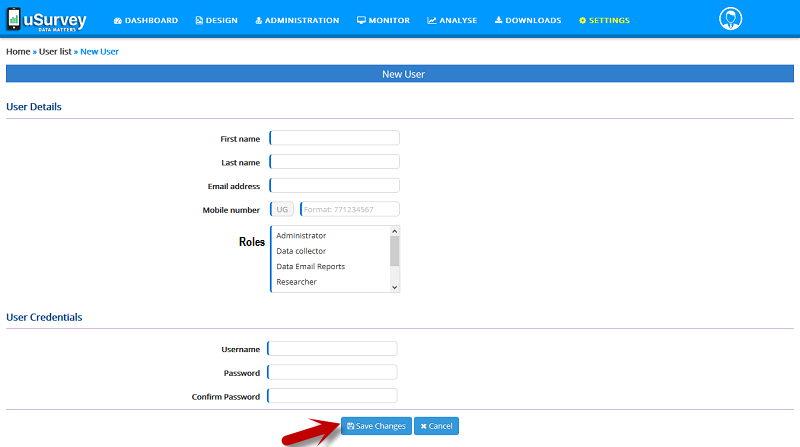

**Elements in the registration form**

**First Name**: First Name of the User

**Last Name**: Last Name of the User

**Email Address**: email id of the User

**Mobile Number**: Contact number of the User

**Roles**: Assign a desired Role to the User

**User Name**: Enter the desired username for the User, to access the portal

**Password**: provide password

**Confirm Password**: conform once again password provided

A New User is enrolled by providing above all field, finally click on ‘Save Changes’ button to complete the process.

In this page, Users are also managed, i.e. to Edit Details and Activate/Deactivate User

**Actions**:

**View Details**: View User profile and Edit details, just click on ‘Edit’ button at the bottom of the page.

**Edit**: To quickly edit User profile

**Activate/Deactivate**: Option to make User Active or In-Active to retain in the system.

* **Search**: One can find Users in system by two ways:
* **Sort** Users by their ‘Status’ by selecting status at top of this page. Or
* **Search** using the search bar at top right side of this page, by providing User’s Name.

**Export Users**: On click, ‘Download Users’ button, one can export the Users list in “.csv” file format.

