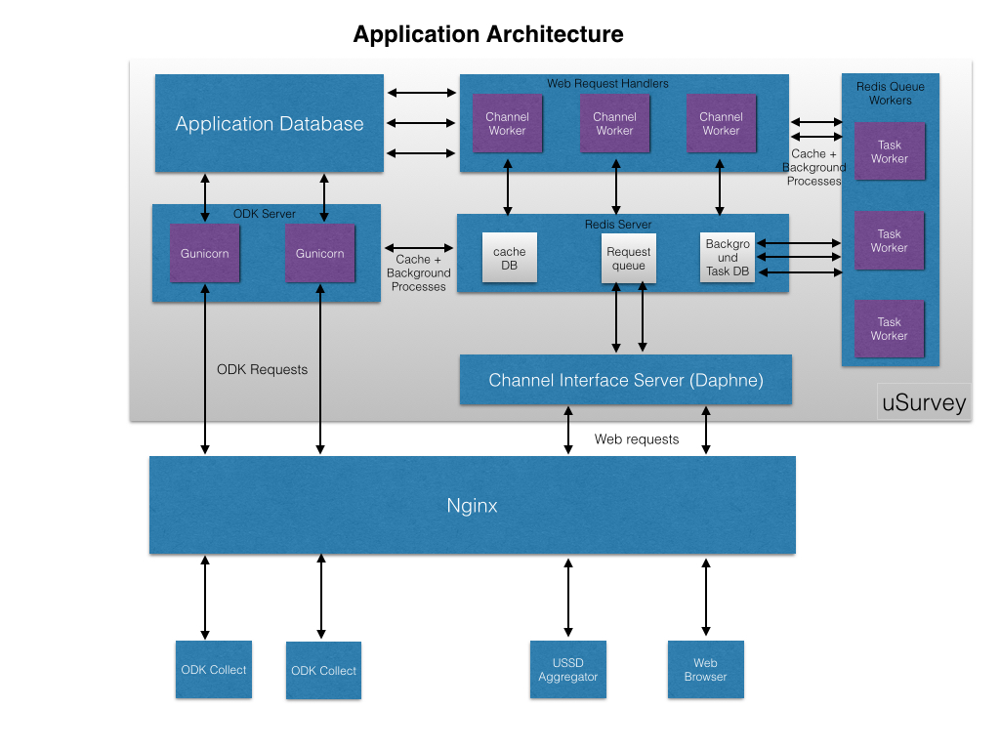

uSurvey Deployment
==================

Deploying uSurvey requires the setup of a few supporting software for the application to be up and running. Details about the application architecture and deployment considerations are covered in this document.

Application Architecture
------------------------

The diagram below depicts the basic architecture of uSurvey. While requests can be sent directly to uSurvey Application servers, we recommend you route this through a web server like Nginx so that static resources can be served more efficiently and any additional layer of performance tuning can be applied on that front.
 

Components
----------
The uSurvey solution is composed of the following software components:

1. Application database is Postgres.
2. Gunicorn is used as application server for ODK collect requests.
3. Daphne is used as app server for web requests and to support server side notifications on uSurvey
4. Redis Server is used as application cache, for background tasks and for as channel backend for the ASGI interface server.
5. Application framework itself is django 
6. For web server, Nginx is the recommended choice. Ssample configuration has been added in the project folder (nginx.snippet file).

Deployment
----------

This section discusses deployment considerations for uSurvey. For information on how to install uSurvey on a machine, see the [installation instruction](./installation.md "Installation Instruction")

###Development Server

####Minimum Requirements

* uSurvey has been tested on Ubuntu and OS X. However it should run on most Linux machines (since there are no distribution specific dependency).

* Minimum of 1GB RAM, 1 CPU core, 20GB disk space for setup and testing.

* Postgres, redis-server needs to be installed and should be running (all can run on same machine)

* It helps to install python-dev, libxml2-dev, libxslt1-dev, zlib1g-dev and libffi-dev (for a debian based system, the command would be *sudo apt-get install python-dev libxml2-dev libxslt1-dev zlib1g-dev libffi-dev*)

* uSurvey has been tested on python2.7 and is compatible with django 1.8 and django 1.9 as of this time of writing. 

* Required python libraries are contained in the pip-requires.txt file found within the project directory.

* For step by step guide on installation and related setup scripts, see the [installation instruction](./installation.md "Installation Instruction")

###Production Setup

For a production setup, uSurvey can be deployed as a stand alone instance or in a clustered environment for high availability and distributed load. uSurvey also performs well either on a virtual machine or on physical hardware, although it has its benefits to run on virtual machine so that system resource can be upgraded when needed.
  
####Recommendations on Infrastructure Sizing
  
Sizing considerations for infrastructure would largely depend on the expected traffic on the system. However by using a virtual machine per setup and possibly using a load balanced cluster, it is easy to scale up the system to handle any load.
 
For a typical production setup for a self sufficient server instance capable of handling a million hits per day, uSurvey requires:
 
* Linux machine (tested on Ubuntu 12+ and Mac Os X)
* 8GB RAM, Octa-core Xeon Processor
* 1 or more Redis servers either running on same machine or on a separately managed cluster

For database:

* Linux machine (tested on Ubuntu 12+ and Mac Os X)
* 8GB RAM, Octa-core Xeon Processor
* Postgres database

####High Availability Considerations

With the already highlighted recommendations on sizing, it is easy to plan for a high availability setup. For a simple HA setup, you might consider the architecture below:

Although the redis cluster has been separated in the design, there is no reason why they cannot all be distributed within the two application servers so avoid the need for extra infrastructure.  

Key components here are:

* 1 Load balancer expected to distribute requests evenly between the two servers 
* 2 Application servers both on Host standby
* 2 Postgres servers running in Master-Slave configuration
* 2 Redis server per server instance (though 1 per instance is equally usable)

  
  
uSurvey Hosting
---------------

While we have ensured to make uSurvey documentation as detailed as possible, it is advisable to engage uSurvey experts to ensure best experience during the run of your surveys.
  
As an option, three models exist for hosting uSurvey:
  
1. Local instance deployed and managed on Client servers.
2. Dedicated hosting deployed and managed in the cloud.
3. Shared hosting where your instance would coexist in parallel with others (although your data would be collected separately).
   