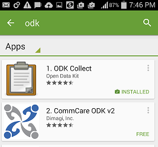
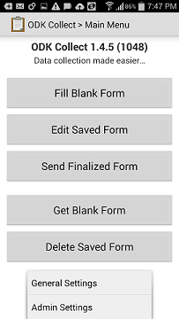
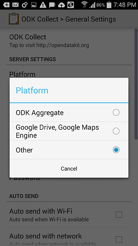
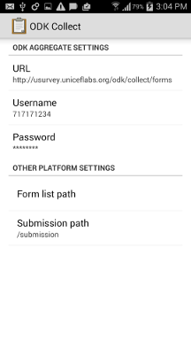

Offline Data Collection
=======================

Once a survey is designed on the uSurvey portal, the data can be collected online using the USSD channel or offline using ODK Collect.

Offline data collection on uSurvey happens with the use of [ODK Collect](./https://play.google.com/store/apps/details?id=org.odk.collect.android&hl=en). 

ODK Collect provides support for richer datasets compared to USSD (for example, it supports media files and GPS location capture). 

Because data collection on ODK is entirely offline, it enables data collection in regions where network connectivity might be an issue. For this, data can be collected seamlessly for as many participants as possible into corresponding Android device and upon completion, all the data can be uploaded once to the server in a location with connectivity.
  

###What do I need to collect data offline?

1. An Android device able to run [ODK Collect](./https://play.google.com/store/apps/details?id=org.odk.collect.android&hl=en). Typically Jelly Bean and newer versions should be fine.
2. The Android device needs to have some space to keep collected data (If your survey does not require the upload of media files, 100MB space would usually be big enough. But having 1GB dedicated for uSurvey is best). 
2. You need to configure ODK collect to use the in-built ODK aggregator in uSurvey (described below).
3. Enter your interviewer credentials and download the survey allocated to you

Once you have completed the above steps, you can collect the survey data completely offline! Upon completion, you move to a location with network connectivity to upload to uSurvey.  

How To Use ODK Collect For uSurvey?
==================================

To use the ODK Collect for uSurvey is easy. Just follow the steps below and you are good to go.

###Download ODK collect from Google Play

  - On your Android device, go to play store
  - Search for "ODK" and choose "ODK Collect" from "Open Data Kit"
  - Select ‘ODK Collect ‘ in the result and click the Install button. Click OK after viewing the security settings
  - Once downloaded, open the ODK Collect from the application list (see image below).
 
    

###Configure ODK Collect

  - For first time use, you need to configure the server url on ODK collect in order to download the survey forms
  - To configure the server url, press the Menu button on the phone while the ODK collect app is opened, then Select ‘General Settings’:
    
  - Selecting the ‘General Settings’, takes you to a new screen to change setting
  - Select ‘Platform’ and select ‘Other’ as shown in the screenshot:
    
  - Under ‘Configure platform settings’, enter the following details - 
    * Enter Server URL according to the format http(s)://$HOSTNAME:$ODK_SERVER_PORT/odk/collect/forms (e.g.https://example.com:8013/odk/collect/forms)
    * **$ODK_SERVER_PORT** is the port on the server mapped to [program:odk-server] section in supervisord.conf file  
    * You need an interviewer defined on uSurvey portal and defined with an ODK ID
    * Enter the ODK username of this interviewer
    * Enter the ODK token defined for the interviewer:
      
    * In the ‘form list path’  fields, leave this blank
    * Under submission path, keep ‘/submission’
    * After making changes, go back to ODK Collect Main menu

###Using the ODK collect

  - From ODK Collect Main menu, select ‘Get Blank Form’
  - ODK Collect will display the open survey at the location assigned to the interviewer
  - Download the required survey.
  - After downloading the survey form, you start the survey by choosing ‘Fill Blank Form’, then select the particular survey.
  - After completing a survey, you submit completed forms by clicking on the "Send Finalized Form" button.
  

    
  
