uSurvey User Manual
===================

The General flow for the uSurvey is as follows:

1. Admin user creates uSurvey users and assigns them user roles

2. Data researcher user defines Question modules, Household member groups and loads survey with questions into the system

3. Data researcher defines interviewer on the system and assigns them to an Enumeration area and survey to conduct

4. Interviewer goes out on the field to designated enumeration area to conduct the actual survey

5. Interviewer captures household and member details as well as relevant questions asked to the house member. These inputs are sent to uSurvey server via mobile

6. Data collected from Interviewers is then viewed on the uSurvey portal for reporting and analysis


At any point on the uSurvey portal, there is bread crumbs that enable easier navigation between related uSurvey screen:
 
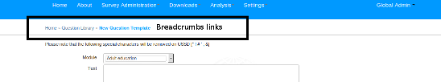 

###Login

To login, uSurvey landing page, click on login link on top right of the page:


This brings out the login page for user to enter user name and password.


###Map Page

The map page is used to display survey report on a country map as per primary Administrative divisions. Eg for Uganda, that would be District, For South Africa, that might correspond to Provinces.
   
The Map page is accessible only after user login under path **/home/**.

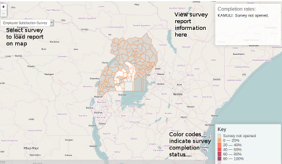

On the page, the drop down at the left corner of the page contains surveys whose report to display on map.

To get survey report on the map, select the relevant survey and the report is loaded into the map.

Hover over the relevant Administrative division on map to view completion report at the top right of the page.

Bottom right of page shows color codes used to indicate completion status on map. 

###Interviewer Page

The interviewer page is used to manage interviewers and to assign them to a survey. Once logged in, interviewer page is available under ```Survey Administration >> Interviewers```

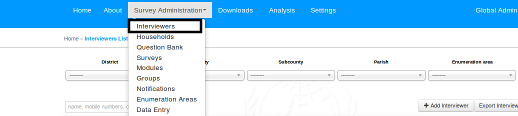

There are a couple of controls/filters on the page:

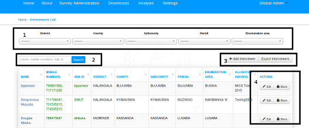

1. Filter controls are used to narrow down on interviewers displayed on screen based on Administrative divisions of the particular country and Enumeration area. 

2. Search box is used to search for interviewers on the page based on search criteria

3. Click on Add Interviewer Button to add interviewer. Click on Export Interviewer to download all interviewers in system.

4. These buttons are used to perform actions on particular interviewers:
    - Edit button is used to edit interviewer
    - Block button is used block particular interviewer from all access channels for survey
    
* Note:

For each interviewer, active numbers/odk access are having green color. The deactivated access credentials are having red color. 
 
####Add Interviewer

To add new interviewer, From Interviewer page click on the Add Interviewer Button. Add Interviewer page looks like this:


The Administrative Division filters at the top of the page is used to control displayed Enumeration areas to select from (tagged EA Filters in above image).

Multiple Interviewer mobile numbers are allowed. To add multiple numbers to an interviewer, simply click on the ```add mobile number``` link to add new mobile number to interviewer.

To disable Any ODK access or Any mobile number for the interviewer, simple uncheck the ```Activated``` checkbox for that number or ODK access.

The interviewer can access the survey system with **Only** active Mobile numbers/ODK credentials. Deactivated access details can not be used by the interviewer until activated. 

Once full details is complete, new record is saved by clicking on the Save button. To cancel, click the cancel button.

The add interviewer page also lets users assign survey to an interviewer. Simply select the correct survey to assign to the interviewer before saving the form. 
 
####Edit Interviewer 

To Edit interviewer record, from interviewer landing page, click on respective interviewer name 


This would lead to page as the add interviewer page. Edit and same accordingly.


###Managing Enumeration Area

To view available enumeration areas in the system, go to ```Survey Administratio >> Enumeration Areas```

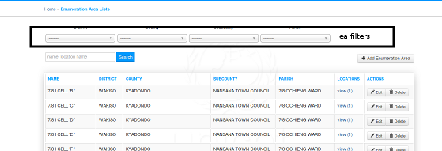

1. It is possible to filter out enumeration areas using Administrative division filters

2. It is possible to search by EA name and corresponding smallest division names

3. It is possible to edit and delete EA

4. To Add new EA, click on the ```Add Enumeration Area``` button

   

5. To create new enumeration area, use the Administrative division filters to narrow down the locations to build the 
   enumeration areas from.
   
6. Name the new enumeration area and save   
   

###Question Module

Question Module provide a way to categorize questions. Question Module page is available under ```Survey Administration >> Modules```

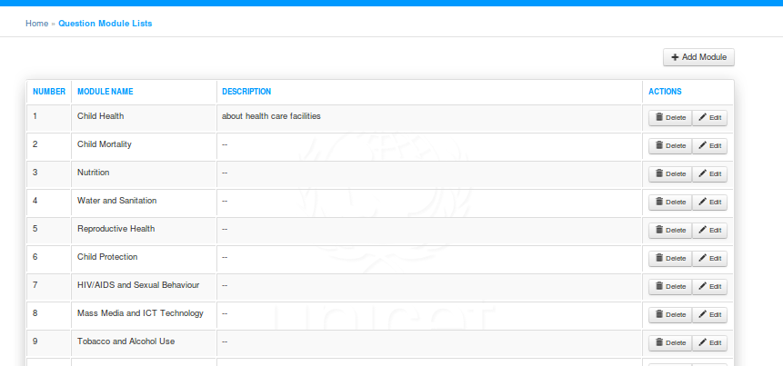 

To add new module, simply click on the add module link at the top right of the page. Fill in the name and description of the module and save.

Editing a module, clock on the Edit button of that module. 

###House Member Group

To define House member groups on the survey, under SurveyAdministration, click on **Groups**
 

 
To add new member group, click on the ```Add Group``` link at the top of the page. To edit an existing member group, simply click on the relevant group name for the member group.
 
 
###Question Library

Question Library allows the user to design a library of questions which can be reusable accross survey batches.

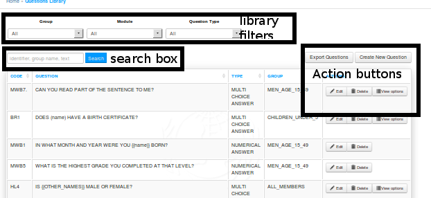

Question library page has filters at the top of the page to enable filtering of question by member group, Module and Answer type
 
Search box enables searching by identifier, group name and text.
 
To add new question to the library, click on the ```Create New Question``` button at the top right page.  

To edit question in the library, click on the edit button for the relevant question.

To export all questions in the library, click on the ```Export Question``` button at the top right of the page.


####Add/Edit Library Question

To add new question to the library, click on the ```Create New Question``` button at the top right page.  

To edit question in the library, click on the edit button for the relevant question.

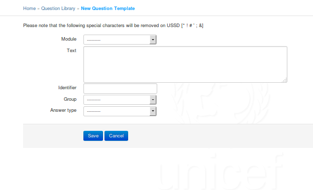

Enter correct values for Module, text, identifier etc.  Save or Cancel when complete.

###Survey Management
The survey page is available under ```Survey Administration >> surveys```

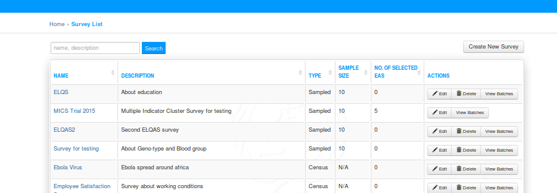

On the survey page, it is possible to search by survey name and survey description.

####Creating New Survey
To create a new survey, click on the ```Create New Survey``` button at the top right of the page. This would produce a pop of form.

- Enter the survey name and Description.

- For Survey Type, select Sampled if the survey uses sample size. Select census if the survey does not use sample size.

- If fresh survey listing is not required for this survey, select the existing survey listing to use (if it exists for the interviewer EA). Otherwise, leave option as blank for fresh survey listing for each new enumeration area.
 
 
####Modify Survey

To edit survey, click on the relevant survey name and edit the survey. Edit accordingly and save.

####Adding Batches To Surveys

To add/edit/view batches to a survey, click on view batches of the particular survey.

This leads to the batch page of the particular survey.

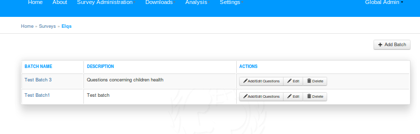

To add new batch, click on the ```Add Batch``` button on top right of survey batch page. This brings the survey batch page:

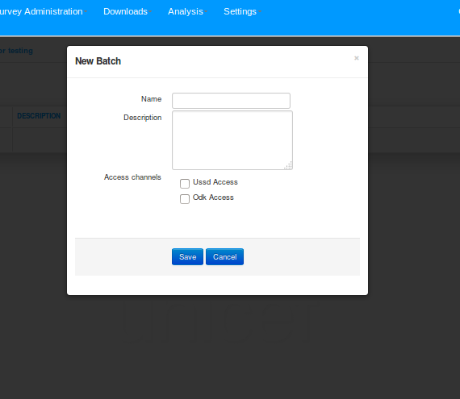

- Enter name and description of the survey

- Select the access channels for which the batch is applicable.

   **Note:** Selecting only USSD Access enables question answer types applicable to USSD only (Text, Number and Multichoice)
             Selecting ODK Access enables all answer types
       
- Once done click on save or cancel.

To Edit or delete batch, click on the relevant button for the survey batch.

####Managing Batch Questions

To manage batch questions, click on the Add/Edit questions button.

This leads to batch questions page.

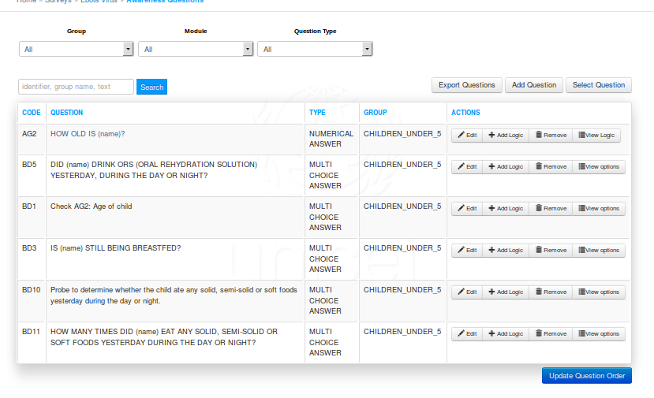

**Note: For survey batches, during data collection, following fixed questions pertaining to each house member are asked 
before actual batch questions begin**

    1. First name of House member
    
    2. Family Name of House member
    
    3. Date of Birth
    
    4. Gender
    
    5. House Address (for house head)
    
    6. Date of Residence (for house head)
    
    7. Level of Education (for house head)
    
    8. Occupation (for house head)

The parameters are used for batch question flow logic.   

**Do not include this within the batch questions**

1. To Add a brand new question to the batch, click on the ```Add Question``` button from the buttons group at the top of the page.

2. To import question from question library into the batch, click on ```Select Question``` from the buttons group.
 
      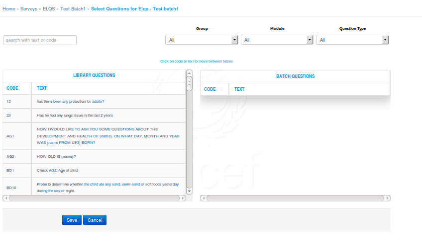
 
    *  Simply click on questions from the library questions table to move them into the batch questions table.
        
    *  To narrow options on the question library, enter search criteria on the search box, then move question to batch questions table.
    
    *  The page also allows filtering down of library questions based on module, group or answer type
    
    *  When done, click on save/cancel.
     
3. Once questions has been created into the batch, it is possible to change the order of the survey. To do this, simply 
drag the question up or down to the position of interest.Do this for all required questions until desired flow of 
questions is achieved from first to last question. Once done, click on Update Order to save new batch question flow.

    Internally, uSurvey batch keeps track of the first batch question, then next question is chained to the previous using
question logic.

4. To add specific logic to batch question flow, simply click on ```Add Logic``` button for the batch question. This leads to the question logic page.

    
    
    *  Configure the required logic for the selected question and save.
    
    *  It is possible to view options and logic tied to particular batch questions also.
    
    
###Enabling Batch For Data Collection

To enable a batch for data collection,

1. Go to the surveys landing page (```Survey Administration >> Surveys```)

2. Click on view batches for the relevant survey
 
2. On survey batches page, click on open/close for the batch to be enabled for data collection

    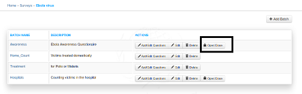

3. Enable the batches in the required Primary Administrative division by sliding the division's status button until it shows green
    
    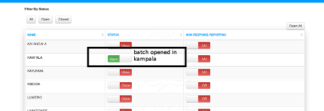
 
4. For the batches with open status, interviewers would be able to collect survey data if their Enumeration Area falls within the Administrative division
    
###Download Data

Data for completed surveys is available uSurvey under link Downloads/Download Datasheet. 

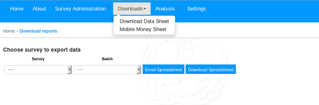

Simply select survey, batch and either download the reports or email. Email is sent to the registered email address 
of the current logged in user. 

The reports contain data entries from both ODK and USSD channels.

###Batch Data Collecting Interviewers

To download interviewers who collected data for particular batch, Under Downloads, click the Mobile Money sheets link.


Select the survey and batch, then download the data.


###Analysis

####Indicators

Indicators page is used to capture specific statistic.Eg, Percentage of householdes having a mobile phone.

Indicators page is accessed under ```Analysis/Indicators```. 


To use

- Create new Indicator

- Define the formula (criteria) used to calculate the indicator.

- View the Analysis report of the indicator criteria on presently collected data


To Add new Indicator, click on the ```Add Indication``` button at the top right of the page. Enter the indication 
parameters and save.


To Define the formulae for the indicator, click on the formula button of the Indicator.
 
 

Depending on the type indicator created, define the formula and save.
 

To view Analysis report of an indicator, click on the indicator Analysis button

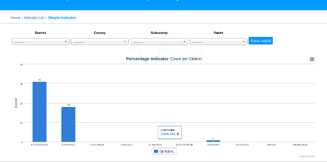
 
*  Initial page displays analysis reports as per primary Administrative division.

*  To get more fine grained report, use the Administrative division filters starting from primary division. 
    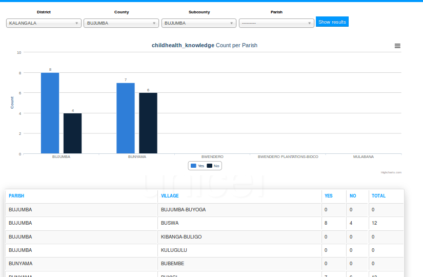

*  Supported export formats are PNG, JPEG, PDF and SVG.


###Survey Completion Statistics

Survey completion statistic is available under ```Analysis/Completion Rates```

To get completion statistic for specific administrative division:

1. Select survey
2. Select batch
3. Use the Administrative division filter to navigate to the division of interest

        

4. After navigating to the smallest administrative division, select relevant EA to get EA level break down. 

    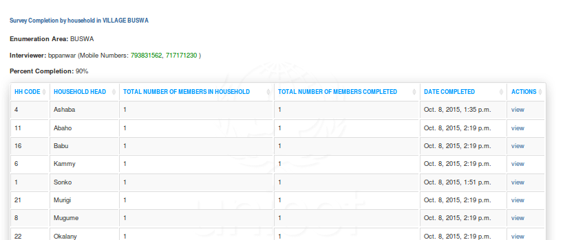
    
    This reveals household completion summary. 

5. To view responses from each Household member of a particular household in the Enumeration area,
    click on the ```view``` link under the household actions
    
    
       
    This gives breakdown of responses for the particular household.
    
    
###Managing Users

To access to create/modify users is available under ```settings/Users``` link.

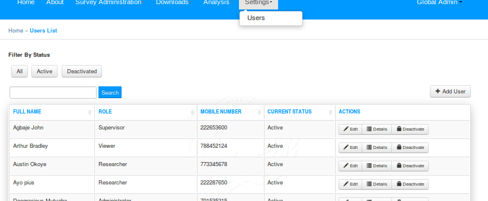

To add new user, simple click the ```Add User``` button at the top right of the page.
 
To Edit User, click on the edit button of the relevant user and enter the user details.
 


 
    

 
 


